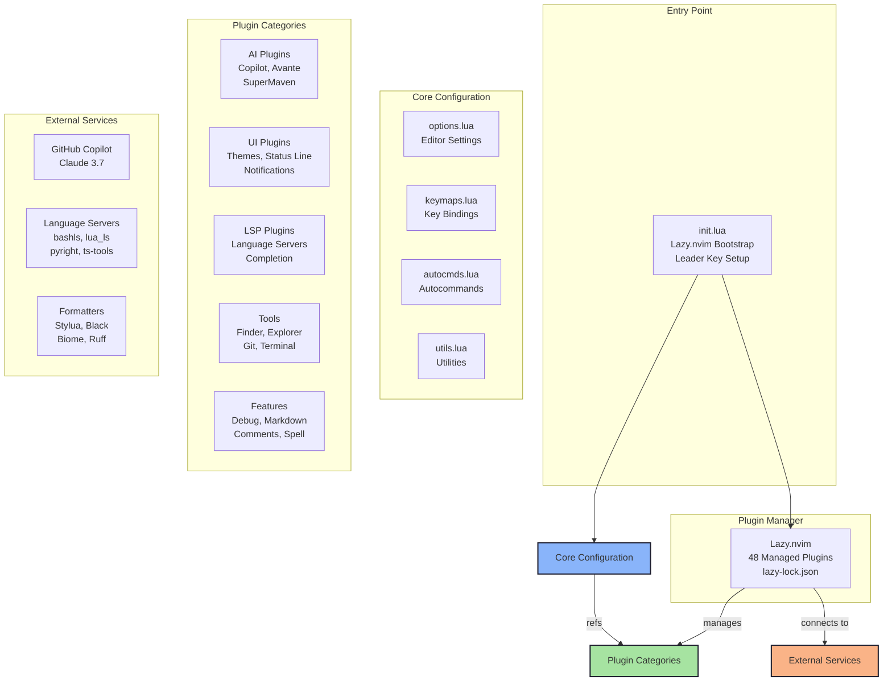
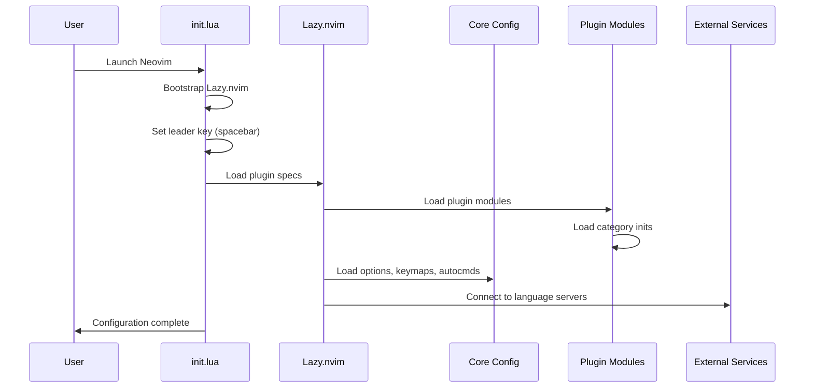
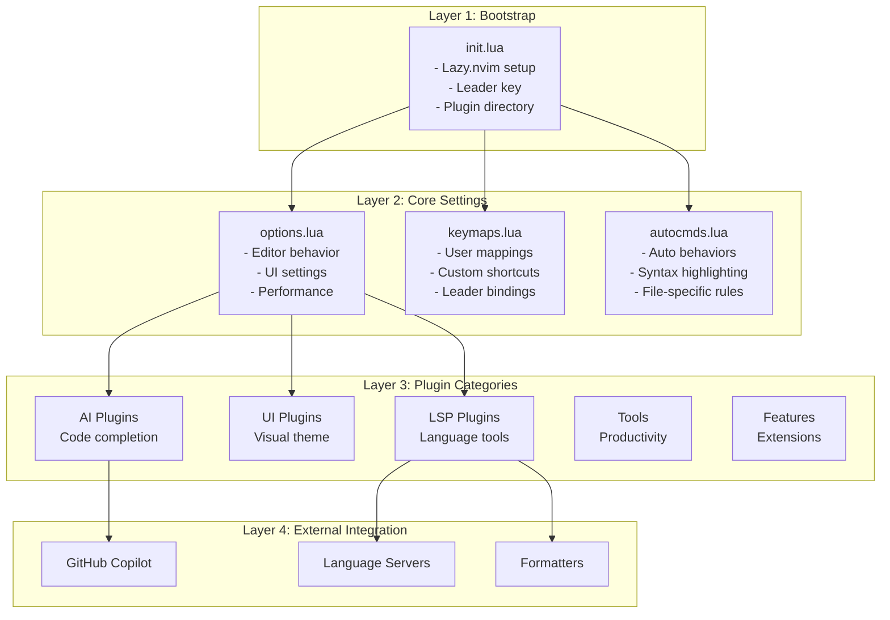
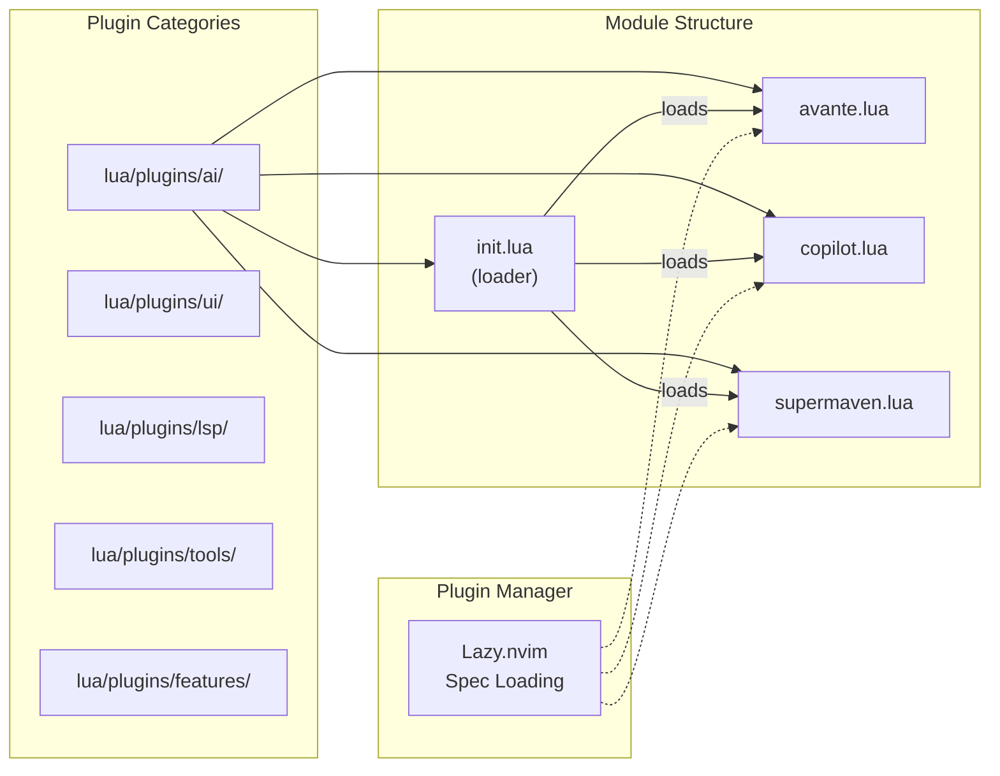
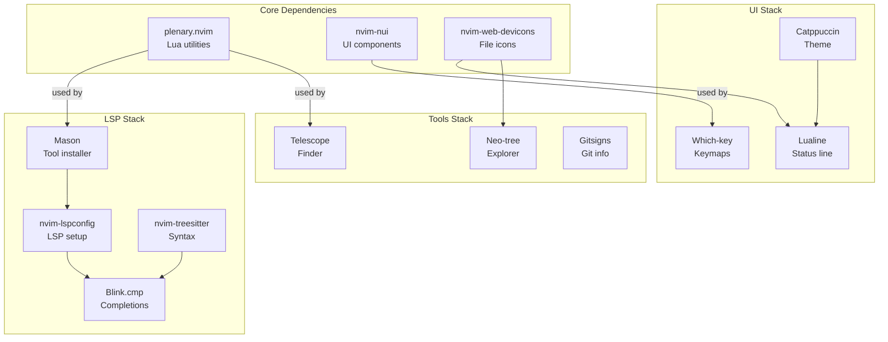
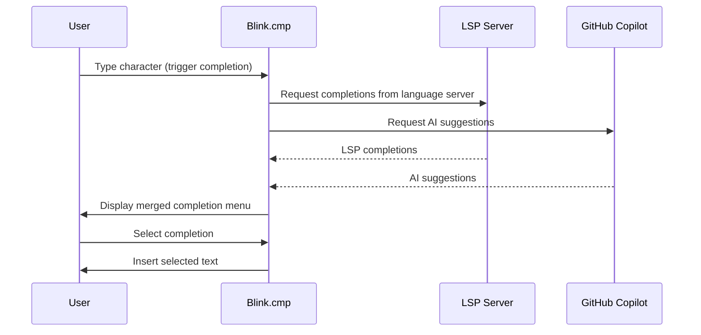
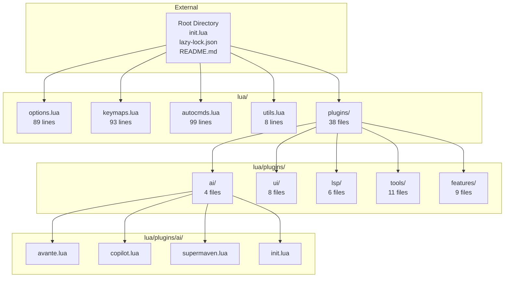
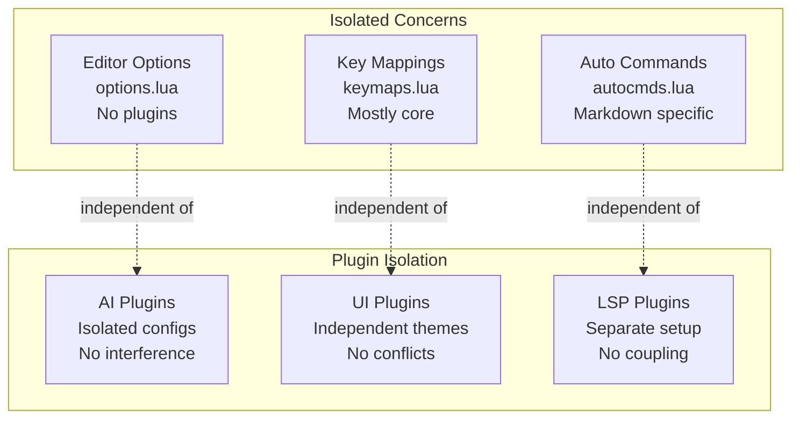
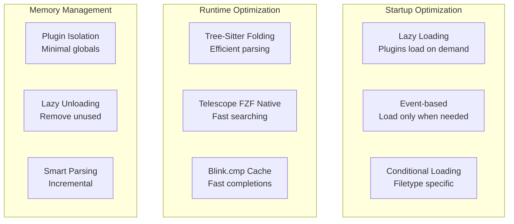
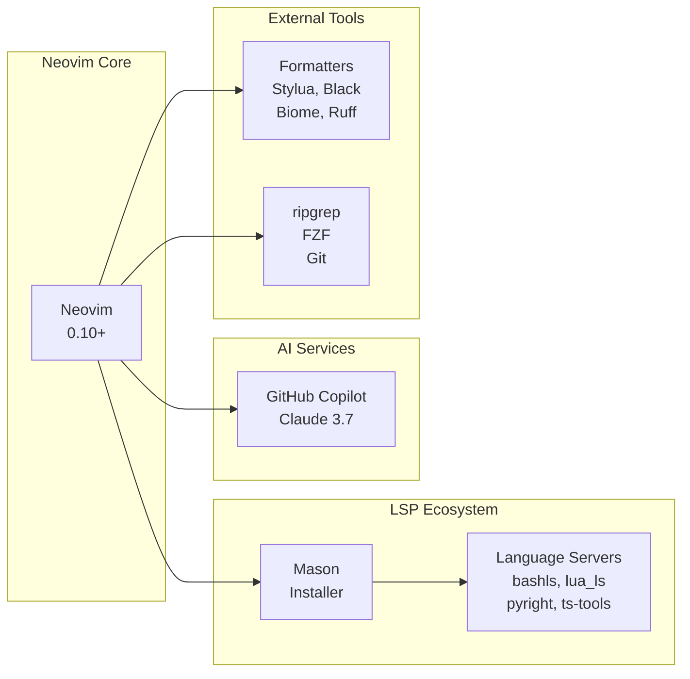

# Neovim Configuration Architecture

## System Architecture Overview



## Initialization Flow



## Configuration Layering



## Plugin Architecture

### Plugin Discovery Pattern



### Plugin Dependencies



## Data Flow: Code Completion Example



## Directory Structure Mapping



## Configuration Loading Sequence

1. **Neovim Start**
   - User launches `nvim` command
   
2. **init.lua Execution**
   - Lazy.nvim bootstrap code
   - Leader key set to spacebar
   - Plugin spec directory specified
   
3. **Lazy.nvim Plugin Loading**
   - Reads all `lua/plugins/*/init.lua` files
   - Each init.lua returns specs for its category
   - Lazy loads plugins based on events/commands
   
4. **Core Configuration Loading**
   - `lua/options.lua` applied
   - `lua/keymaps.lua` mapped
   - `lua/autocmds.lua` registered
   
5. **Plugin Initialization**
   - Each plugin's setup() function called
   - External services connected (LSP, GitHub Copilot)
   - Lazy loading triggers when needed
   
6. **Ready for User**
   - Configuration complete
   - All keybindings available
   - LSP servers connected

## Module Loading Pattern

Each plugin category follows this pattern:

```
lua/plugins/[category]/
├── init.lua          # Loads all plugins in category
├── plugin1.lua       # Individual plugin specs
├── plugin2.lua
└── ...

-- init.lua example:
return {
  require('plugins.[category].plugin1'),
  require('plugins.[category].plugin2'),
  -- ...
}
```

## Configuration Isolation



## Extension Points

Configuration can be extended by:

1. **Adding new plugin files**
   - Create `lua/plugins/[category]/[plugin].lua`
   - Add return statement with plugin spec
   - Category init.lua auto-loads it

2. **Adding new keybindings**
   - Edit `lua/keymaps.lua`
   - Follow existing conventions

3. **Adding new options**
   - Edit `lua/options.lua`
   - Apply Neovim option settings

4. **Adding new autocommands**
   - Edit `lua/autocmds.lua`
   - Register auto behaviors

5. **Creating new category**
   - Create `lua/plugins/[newcategory]/` directory
   - Create `init.lua` with plugin specs
   - Create individual plugin files

## Performance Architecture



## Integration Points



## Summary

The Neovim configuration follows a **layered, modular architecture** with:

- **Clean separation**: Bootstrap → Core Config → Plugins → External Services
- **Lazy initialization**: Plugins load on-demand via Lazy.nvim
- **Modular organization**: Each plugin in its own file, grouped by category
- **Extension-friendly**: Easy to add new plugins or configuration
- **Performance-focused**: Lazy loading, conditional loading, efficient tools
- **Well-integrated**: LSP, Git, AI, and development tools seamlessly connected

This architecture enables maintainability, extensibility, and high performance in a complex configuration with 48+ managed plugins.
