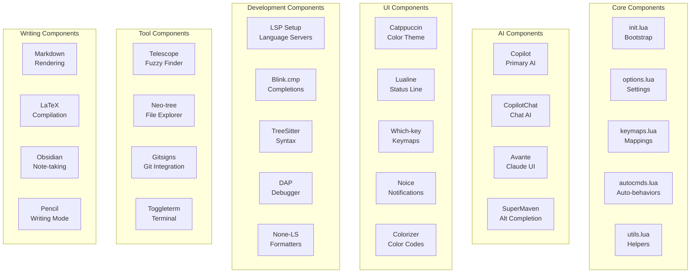
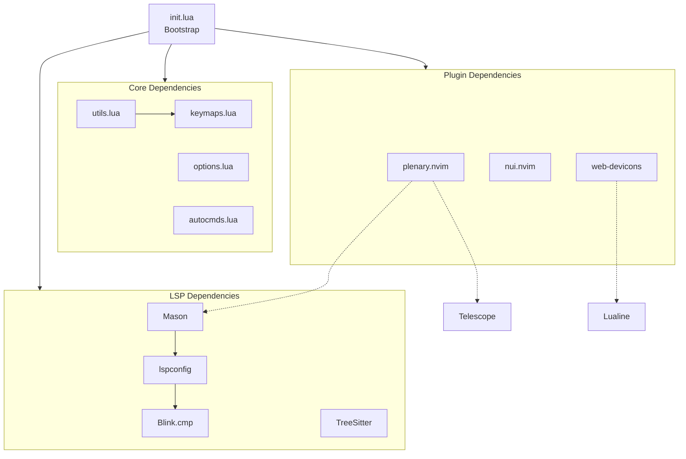

# Neovim Configuration Components

## Component Overview



## Detailed Component Specifications

### 1. Core Bootstrap Component (init.lua)

**Location**: `init.lua` (root)  
**Purpose**: Main entry point for Neovim configuration  
**Responsibilities**:
- Bootstrap Lazy.nvim plugin manager
- Set leader key to spacebar
- Load plugin specifications from `lua/plugins/`
- Initialize core configuration

**Key Functions**:
```lua
-- Lazy.nvim bootstrap
require("lazy-bootstrap").setup()

-- Leader key configuration
vim.g.mapleader = " "
vim.g.maplocalleader = " "

-- Plugin spec directory
require("lazy").setup("plugins", opts)
```

**Dependencies**: Lazy.nvim bootstrap code  
**Extends**: All other configuration modules  
**Triggers**: On every Neovim startup

---

### 2. Options Component (lua/options.lua)

**Location**: `lua/options.lua`  
**Size**: 89 lines  
**Purpose**: Configure Neovim editor behavior and visual settings  
**Responsibilities**:
- Set line numbering options
- Configure folding behavior
- Enable mouse support
- Sync system clipboard
- Set indentation and formatting rules
- Configure UI elements

**Key Settings**:
- `number`: Show line numbers
- `relativenumber`: Relative line numbering
- `foldmethod`: Tree-Sitter folding
- `mouse`: Enable mouse in all modes
- `clipboard`: System clipboard integration
- `expandtab`: Spaces instead of tabs
- `shiftwidth`: Indentation width

**Configuration Style**: Direct vim.opt assignments  
**Dependencies**: None  
**Loaded**: Early in initialization  
**User-facing**: Affects all editing sessions

---

### 3. Keymaps Component (lua/keymaps.lua)

**Location**: `lua/keymaps.lua`  
**Size**: 93 lines  
**Purpose**: Define all custom key bindings  
**Responsibilities**:
- Buffer navigation mappings
- File operation shortcuts
- Finder/telescope integrations
- Spelling command shortcuts
- Comment toggle bindings
- LSP refactoring shortcuts
- Document conversion keys
- Obsidian integrations

**Key Bindings**:
| Keymap | Action |
|--------|--------|
| `<leader>bn` / `<leader>l` | Next buffer |
| `<leader>h` | Previous buffer |
| `<leader>w` | Save file |
| `<leader>p` | Toggle explorer |
| `<leader>ff` | Find files |
| `<leader>fw` | Live grep |
| `<leader>fg` | Multi-grep |
| `<leader>/` | Toggle comment |
| `jj` | Escape (insert mode) |

**Mapping Pattern**:
```lua
local map = require("utils").map
map("n", "<leader>w", "<cmd>w<CR>", { noremap = true, silent = true })
```

**Dependencies**: `lua/utils.lua` (map function)  
**Loaded**: Early in initialization  
**User-facing**: All interactive keybindings

---

### 4. Autocommands Component (lua/autocmds.lua)

**Location**: `lua/autocmds.lua`  
**Size**: 99 lines  
**Purpose**: Register automatic behaviors and syntax highlighting  
**Responsibilities**:
- Custom markdown syntax highlighting
- Virtual indentation setup
- Telescope auto-open on startup
- File-specific autocommands

**Auto-behaviors**:
- Markdown file detection
- Custom highlighting groups for pandoc markup
- Virtual indent guide configuration
- Telescope startup behavior

**Event Handlers**:
- `BufRead`: File open events
- `BufEnter`: Buffer switch events
- `VimEnter`: Neovim startup
- `FileType`: File type detection

**Dependencies**: None  
**Loaded**: During initialization  
**Runtime**: Triggers based on events

---

### 5. Utilities Component (lua/utils.lua)

**Location**: `lua/utils.lua`  
**Size**: 8 lines  
**Purpose**: Provide shared helper functions  
**Responsibilities**:
- Keymap creation helper function

**Exported Functions**:
```lua
utils.map(mode, lhs, rhs, opts)
```

**Dependencies**: None  
**Used by**: keymaps.lua, individual plugins  
**Pattern**: Centralized utility module

---

### AI Components

#### 6a. GitHub Copilot (lua/plugins/ai/copilot.lua)

**Status**: Active (Primary)  
**Model**: Claude 3.7 Sonnet  
**Features**:
- Code completion suggestions
- CopilotChat for conversational coding
- Inline documentation
- Multi-file context awareness

**Configuration**:
- Auto-trigger on typing
- Chat integration via CopilotChat
- Custom keybindings in keymaps.lua

**Dependencies**: GitHub Copilot API access  
**Performance**: Async, non-blocking suggestions  
**Integration**: Integrates with Blink.cmp

#### 6b. Avante (lua/plugins/ai/avante.lua)

**Status**: Disabled by default  
**Purpose**: Alternative Claude-based AI interface  
**Features**:
- Code editing via AI
- Custom prompt system
- Multi-tool integration

**Use Case**: When advanced AI interface needed  
**Dependencies**: Avante setup requirements

#### 6c. SuperMaven (lua/plugins/ai/supermaven.lua)

**Status**: Disabled by default  
**Purpose**: Alternative fast code completion  
**Features**:
- Lightweight completion
- Fast inference

**Use Case**: Performance alternative to Copilot

---

### UI Components

#### 7a. Catppuccin Theme (lua/plugins/ui/catppuccin.lua)

**Type**: Color theme  
**Flavor**: Frappe (dark)  
**Features**:
- Transparent background
- Carefully designed color palette
- Support for syntax highlighting
- Plugin-specific color overrides

**Configuration**:
```lua
{
  flavour = "frappe",
  transparent_background = true,
  -- color overrides
}
```

**Dependencies**: Catppuccin plugin  
**Applies to**: All UI elements

#### 7b. Lualine Status Line (lua/plugins/ui/lualine.lua)

**Type**: Status line  
**Purpose**: Display mode, file info, diagnostics  
**Features**:
- Custom theme from `lualine/theme.lua`
- Multi-section layout
- Git branch display
- LSP status
- File encoding and format

**Configuration**: `lua/plugins/ui/lualine.lua`  
**Theme**: `lua/plugins/ui/lualine/theme.lua`  
**Loaded**: Lazy, on VimEnter

#### 7c. Which-Key (lua/plugins/ui/which-key.lua)

**Type**: Keymap explorer  
**Purpose**: Display available keybindings  
**Features**:
- Automatic keymap discovery
- Grouped by prefix
- Built-in help display

**Trigger**: `<leader>?` or timeout after leader press

#### 7d. Noice (lua/plugins/ui/noice.lua)

**Type**: UI improvements  
**Purpose**: Better command and notification UI  
**Features**:
- Command line as floating window
- Styled notifications
- Message deduplication

#### 7e. Colorizer (lua/plugins/ui/colorizer.lua)

**Type**: Utility  
**Purpose**: Highlight color codes in files  
**Features**:
- Highlights hex colors (#RGB)
- RGB/HSL color support
- Toggle on/off per file

---

### Development Components

#### 8a. LSP Configuration (lua/plugins/lsp/lsp-config.lua)

**Type**: Language server setup  
**Purpose**: Configure Mason and LSPConfig  
**Installed Servers**:
- bashls (Bash)
- lua_ls (Lua)
- pyright (Python)
- ts-tools (TypeScript)

**Features**:
- Auto-installation via Mason
- Server startup on file open
- Diagnostic display
- Symbol references

#### 8b. Completions (lua/plugins/lsp/completion.lua)

**Type**: Completion engine  
**Engine**: Blink.cmp  
**Features**:
- LSP completions
- Snippet support via friendly-snippets
- AI completion integration
- Fuzzy matching
- Multi-source completion

**Completion Sources**:
1. LSP (primary)
2. GitHub Copilot (AI)
3. Snippets
4. Buffer text

#### 8c. Tree-Sitter (lua/plugins/lsp/treesitter.lua)

**Type**: Syntax parsing  
**Purpose**: Efficient syntax highlighting and folding  
**Features**:
- Auto-install parsers on file open
- Tree-Sitter based folding
- Syntax highlighting for multiple languages

**Configured Languages**:
- Lua, Python, JavaScript, TypeScript
- Markdown, LaTeX, Regex, Bash
- JSON, YAML, HTML, CSS, and more

#### 8d. Formatters & Diagnostics (lua/plugins/lsp/none-ls.lua)

**Type**: Tool integration  
**Purpose**: Formatting and linting  
**Formatters**:
- stylua (Lua)
- black (Python)
- biome (JavaScript/TypeScript/JSON)
- beautysh (Bash)
- ruff (Python)

**Diagnostics**:
- biome (JS/TS/JSON)
- markdownlint (Markdown)
- pylint via pyright (Python)

#### 8e. Debug Adapter Protocol (lua/plugins/features/dap.lua)

**Type**: Debugging  
**Purpose**: Interactive code debugging  
**Debuggers**:
- Python (via nvim-dap-python)
- JavaScript (via vscode-js-debug)

**Features**:
- Breakpoint management
- Variable inspection
- Step through code
- Call stack view

---

### Tool Components

#### 9a. Telescope (lua/plugins/tools/telescope.lua)

**Type**: Fuzzy finder  
**Purpose**: File and text search  
**Features**:
- FZF native backend for speed
- File finder
- Live grep search
- Diagnostics search
- Buffer search

**Key Bindings**:
- `<leader>ff`: Find files
- `<leader>fw`: Live grep
- `<leader>fd`: Find diagnostics

#### 9b. Neo-tree (lua/plugins/tools/filemanager.lua)

**Type**: File explorer  
**Purpose**: Navigate and manage files  
**Features**:
- Tree view of files and directories
- Git status indicators
- File operations (create, delete, rename)
- Filtering

**Key Binding**: `<leader>p` (toggle)

#### 9c. Gitsigns (lua/plugins/tools/gitsigns.lua)

**Type**: Git integration  
**Purpose**: Show git changes and blame  
**Features**:
- Changed line indicators (gutter signs)
- Blame information
- Diff hunks
- Stage/unstage operations

**Integration**: Works with current git repository

#### 9d. Toggleterm (lua/plugins/tools/toggleterm.lua)

**Type**: Terminal integration  
**Purpose**: Floating/split terminal within editor  
**Features**:
- Toggle terminal with single key
- Multiple terminal instances
- Language-specific highlighting

#### 9e. Smart Splits (lua/plugins/tools/smart-splits.lua)

**Type**: Window management  
**Purpose**: Navigate and resize splits  
**Features**:
- Directional window navigation
- Window resizing
- Multiplexer integration awareness

#### 9f. Overseer (lua/plugins/tools/overseer.lua)

**Type**: Task runner  
**Purpose**: Run build and test commands  
**Features**:
- Task templates
- Output display
- Status tracking

---

### Writing & Documentation Components

#### 10a. Markdown Rendering (lua/plugins/features/markdown.lua)

**Type**: Content rendering  
**Purpose**: Render markdown with styling  
**Features**:
- Markdown syntax highlighting
- Image rendering in markdown
- Code block highlighting

#### 10b. LaTeX Support (lua/plugins/tools/latex.lua)

**Type**: LaTeX integration  
**Purpose**: Compile LaTeX documents  
**Features**:
- LaTeX compiler integration
- PDF generation
- Error navigation

#### 10c. Obsidian Integration (lua/plugins/tools/obsidian.lua)

**Type**: Note-taking  
**Purpose**: Integrate with Obsidian vault  
**Configuration**:
- Notes vault location
- Workspace setup
- Custom commands

**Key Binding**: `<leader>ot` (today's note)

#### 10d. Pencil (lua/plugins/tools/pencil.lua)

**Type**: Writing mode  
**Purpose**: Prose/writing mode enhancements  
**Features**:
- Better text wrapping
- Writing-friendly defaults
- Distraction minimization

---

### Feature Components

#### 11a. Comment Toggle (lua/plugins/features/comment.lua)

**Type**: Utility  
**Purpose**: Toggle comments on code lines  
**Key Binding**: `<leader>/` (normal and visual modes)

#### 11b. Mini.nvim (lua/plugins/features/mini.lua)

**Type**: Utility collection  
**Features**:
- Buffer remove (smart buffer closing)
- Auto-pairs (auto-complete brackets)
- Other mini modules

#### 11c. Spell Checking (lua/plugins/features/spell.lua)

**Type**: Language support  
**Purpose**: Multi-language spell checking  
**Configured Languages**:
- English (default)
- Spanish

**Dictionary Location**: `spell/` directory

#### 11d. Silicon (lua/plugins/features/silicon.lua)

**Type**: Code sharing  
**Purpose**: Generate code screenshot images  
**Features**:
- Beautiful code images
- Syntax highlighting
- Custom styling

#### 11e. Typewriter Mode (lua/plugins/ui/typewritter.lua)

**Type**: UI mode  
**Purpose**: Distraction-free writing  
**Features**:
- Centered cursor
- Focused line highlighting
- Minimal UI

---

## Component Dependency Graph



## Component Loading Order

1. **init.lua** - Bootstrap
2. **options.lua** - Editor settings
3. **keymaps.lua** - Key bindings
4. **autocmds.lua** - Auto behaviors
5. **Plugin Categories** - Parallel lazy loading:
   - AI Plugins
   - UI Plugins
   - LSP Plugins
   - Tools
   - Features
6. **External Services** - Connected on demand:
   - Language servers
   - GitHub Copilot
   - Formatters

## Summary

The Neovim configuration consists of:
- **5 core components** (init, options, keymaps, autocmds, utils)
- **38 plugin components** organized in 5 categories
- **13+ major feature categories** with specialized functionality
- **Modular design** enabling independent updates
- **Lazy loading** for performance optimization
- **Clear separation of concerns** for maintainability
