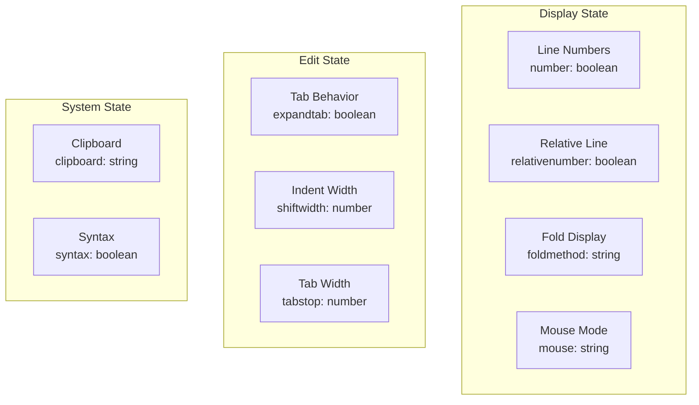
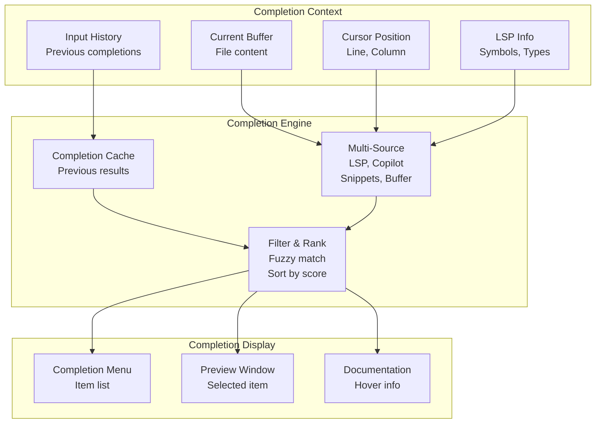

# Neovim Configuration Data Models

## Configuration Data Structures

### Core Configuration Model

```lua
-- options.lua structure
vim.opt = {
  number = true,
  relativenumber = true,
  foldmethod = "expr",
  foldexpr = "v:lua.vim.treesitter.foldexpr()",
  mouse = "a",
  clipboard = "unnamedplus",
  expandtab = true,
  shiftwidth = 2,
  tabstop = 2,
  -- ... more options
}
```

### Plugin Specification Model

```lua
-- Plugin spec structure (Lazy.nvim format)
{
  "plugin-author/plugin-name",
  version = "*",
  event = "VimEnter",
  lazy = true,
  config = function(plugin, opts)
    -- Setup function
  end,
  opts = {
    -- Configuration options
  },
  dependencies = {
    "dependency/plugin1",
    "dependency/plugin2",
  },
  keys = {
    { "<leader>x", "cmd", desc = "Description" },
  }
}
```

### Keymap Entry Model

```lua
-- Keymap data structure
{
  mode = "n",           -- "n", "i", "v", "x", etc.
  lhs = "<leader>w",    -- Left-hand side (key sequence)
  rhs = "<cmd>w<CR>",   -- Right-hand side (command)
  opts = {
    noremap = true,
    silent = true,
    desc = "Save file"
  }
}
```

---

## Plugin Configuration Models

### AI Plugin Model

```lua
-- copilot.lua configuration model
{
  -- Plugin definition
  "github/copilot.vim",
  
  -- Configuration
  config = {
    -- Copilot settings
    suggestion = {
      enabled = true,
      auto_trigger = true,
    },
    -- Model specification
    model = "claude-3.7-sonnet",
    -- Chat configuration
    chat = {
      enabled = true,
      layout = "float",
    }
  }
}
```

### LSP Configuration Model

```lua
-- lsp-config.lua model
{
  servers = {
    bashls = {},
    lua_ls = {
      settings = {
        Lua = {
          runtime = { version = "LuaJIT" },
          diagnostics = { globals = { "vim" } },
          workspace = { library = vim.api.nvim_get_runtime_file("", true) },
        }
      }
    },
    pyright = {},
    ts_tools = {}
  },
  
  -- Common setup
  on_attach = function(client, bufnr)
    -- LSP handlers
  end,
  
  capabilities = require("cmp_nvim_lsp").default_capabilities()
}
```

### Theme Configuration Model

```lua
-- catppuccin.lua theme model
{
  flavour = "frappe",           -- Theme flavor
  transparent_background = true, -- Background style
  
  color_overrides = {
    frappe = {
      base = "#1e1e2e",
      mantle = "#181825",
      crust = "#11111b",
      -- ... color palette
    }
  },
  
  highlight_overrides = {
    -- Custom highlight groups
  }
}
```

### Completion Engine Model

```lua
-- completion.lua (Blink.cmp) model
{
  enabled = true,
  
  -- Completion sources
  sources = {
    default = { "lsp", "copilot", "snippets", "buffer" },
    
    providers = {
      lsp = {
        enabled = true,
        module = "blink.cmp.sources.lsp",
      },
      copilot = {
        enabled = true,
        module = "blink.cmp.sources.copilot",
      },
      snippets = {
        module = "blink.cmp.sources.snippets",
      },
      buffer = {
        module = "blink.cmp.sources.buffer",
      }
    }
  },
  
  -- Keymap settings
  keymap = {
    select_and_accept = "<Tab>",
    cancel = "<C-E>",
  }
}
```

---

## State Data Models

### Neovim Option States



### Buffer State

```lua
-- Buffer local data
{
  filetype = "lua",           -- File type
  buftype = "",               -- Buffer type
  modified = false,           -- Has unsaved changes
  line_count = 100,           -- Number of lines
  name = "file.lua",          -- File name
  -- LSP attached servers
  lsp_servers = {"lua_ls"},
  -- DAP state
  debugger_active = false,
}
```

### LSP State Model

```lua
-- Per-buffer LSP state
{
  client_id = 1,
  server_name = "lua_ls",
  
  capabilities = {
    textDocumentSync = true,
    completion = true,
    hover = true,
    definition = true,
    references = true,
    rename = true,
    formatting = true,
  },
  
  diagnostics = {
    {
      row = 10,
      col = 5,
      severity = "warning",
      message = "undefined variable",
    }
  }
}
```

---

## Completion State Model



---

## Git State Model (Gitsigns)

```lua
-- Per-file git state
{
  file_path = "lua/plugins/ai/copilot.lua",
  branch = "main",
  
  changes = {
    added = { 1, 5, 10 },      -- Line numbers
    modified = { 3, 7, 15 },
    removed = { 20 },
  },
  
  hunks = {
    {
      start = 1,
      count = 5,
      type = "add",
      content = "new lines",
    }
  },
  
  blame = {
    {
      line = 1,
      commit = "abc123",
      author = "User",
      date = "2024-01-15",
    }
  }
}
```

---

## Spell Check Data Model

```lua
-- Spell check state
{
  enabled = true,
  language = "en",
  
  languages = {
    en = {
      dict_file = "spell/en.utf-8.spl",
      suggestions_file = "spell/en.utf-8.sug",
    },
    es = {
      dict_file = "spell/es.utf-8.spl",
      suggestions_file = "spell/es.utf-8.sug",
    }
  },
  
  misspellings = {
    {
      word = "teh",
      line = 5,
      col = 10,
      suggestions = { "the", "tea", "ten" },
    }
  }
}
```

---

## Telescope Finder State Model

```lua
-- Telescope picker state
{
  picker_type = "find_files",
  
  search_query = "",
  search_results = {
    {
      path = "lua/plugins/ui/catppuccin.lua",
      score = 0.95,
      highlights = { { 1, 3 } },
    }
  },
  
  selected_index = 1,
  
  -- Filter options
  filters = {
    hidden = false,
    ignore_patterns = { ".git", "node_modules" },
  },
  
  -- FZF options
  fzf = {
    algorithm = "fzf",
    case_mode = "smart",
  }
}
```

---

## DAP (Debugger) State Model

```lua
-- Debug session state
{
  session_active = true,
  debugger_type = "python",  -- or "javascript"
  
  breakpoints = {
    "lua/plugins/ai/copilot.lua:15",
    "lua/plugins/lsp/lsp-config.lua:20",
  },
  
  current_frame = {
    file = "lua/plugins/ai/copilot.lua",
    line = 15,
    column = 0,
    function = "setup_copilot",
  },
  
  variables = {
    local = {
      { name = "config", type = "table", value = "{...}" },
      { name = "client", type = "userdata", value = "LSP client" },
    },
    global = {},
  },
  
  call_stack = {
    { function = "setup_copilot", file = "copilot.lua", line = 15 },
    { function = "init", file = "init.lua", line = 5 },
  }
}
```

---

## Tree-Sitter State Model

```lua
-- Syntax tree state
{
  language = "lua",
  parser_installed = true,
  
  -- Folding regions
  folds = {
    { start = 1, end = 10, type = "function" },
    { start = 12, end = 20, type = "if_statement" },
  },
  
  -- Syntax nodes
  nodes = {
    { type = "function_declaration", start = 1, end = 10 },
    { type = "parameters", start = 3, end = 5 },
  },
  
  -- Highlighting
  highlights = {
    { range = "1:0-1:8", group = "Keyword" },      -- "function"
    { range = "1:10-1:15", group = "Function" },   -- function name
  }
}
```

---

## Neo-tree File Explorer State Model

```lua
-- File explorer state
{
  current_dir = "/Users/acruz/Library/CloudStorage/Dropbox/Personal/dotfiles/config/vim",
  
  tree = {
    {
      name = "lua",
      type = "directory",
      children = [
        { name = "options.lua", type = "file", git_status = "unmodified" },
        { name = "keymaps.lua", type = "file", git_status = "modified" },
      ]
    },
    { name = "init.lua", type = "file", git_status = "unmodified" },
  },
  
  selection = {
    selected = "lua/plugins/ai/copilot.lua",
    multi_selected = [],
  },
  
  git_status = {
    "lua/plugins/ai/copilot.lua" => "modified",
    "lua/plugins/lsp/lsp-config.lua" => "untracked",
  }
}
```

---

## Obsidian Integration State Model

```lua
-- Obsidian vault state
{
  vault_path = "~/Notes",
  workspace = "personal",
  
  current_note = {
    path = "~/Notes/2024-01-15.md",
    title = "Daily Notes",
    tags = { "journal", "daily" },
    links = { "project-alpha", "meeting-notes" },
  },
  
  index = {
    total_notes = 150,
    recent = {
      "2024-01-15.md",
      "2024-01-14.md",
      "2024-01-13.md",
    }
  }
}
```

---

## Autocommand State Model

```lua
-- Autocommand registry
{
  autocmds = {
    {
      event = "BufRead",
      pattern = "*.md",
      command = "set filetype=markdown",
      group = "MarkdownHighlight",
    },
    {
      event = "VimEnter",
      pattern = "*",
      callback = "require('telescope').extensions.telescope.builtin.find_files()",
      group = "TelescopeStartup",
    },
  }
}
```

---

## Keymap State Model

```lua
-- Keymap registry
{
  normal_mode = {
    ["<leader>w"] = {
      command = "<cmd>w<CR>",
      desc = "Save file",
      buffer = false,
    },
    ["<leader>ff"] = {
      command = "<cmd>Telescope find_files<CR>",
      desc = "Find files",
      buffer = false,
    },
  },
  
  insert_mode = {
    ["jj"] = {
      command = "<Esc>",
      desc = "Escape",
      buffer = false,
    },
  },
  
  visual_mode = {
    ["<leader>/"] = {
      command = "<cmd>Commentary<CR>",
      desc = "Toggle comment",
      buffer = false,
    },
  }
}
```

---

## Status Line State Model (Lualine)

```lua
-- Status line state
{
  mode = "NORMAL",           -- Current mode
  mode_color = "Blue",       -- Mode color
  
  file_info = {
    path = "lua/plugins/ui/catppuccin.lua",
    name = "catppuccin.lua",
    modified = false,
    readonly = false,
  },
  
  lsp_status = {
    servers_active = { "lua_ls" },
    diagnostics = {
      errors = 0,
      warnings = 1,
      hints = 0,
      info = 2,
    }
  },
  
  git_status = {
    branch = "main",
    dirty = false,
    ahead = 0,
    behind = 0,
  },
  
  position = {
    line = 42,
    column = 10,
    percent = 45,
  }
}
```

---

## Summary of Data Models

The Neovim configuration uses hierarchical data models for:

1. **Options** - Global editor settings (boolean, string, number)
2. **Plugins** - Lazy.nvim specification tables
3. **Keymaps** - Mode, key sequence, command, options
4. **LSP** - Server configuration, capabilities, diagnostics
5. **Completion** - Sources, filtering, ranking
6. **Git** - File changes, hunks, blame information
7. **Spell Check** - Language data, misspellings, suggestions
8. **Debugger** - Breakpoints, frames, variables, stack
9. **Explorer** - Directory tree, file metadata, git status
10. **Telescope** - Search results, filters, scoring
11. **Status Line** - Mode, file info, LSP status, position
12. **State** - Buffer-local and global configuration state

All models follow Lua table conventions and integrate seamlessly with the Lazy.nvim plugin framework.
