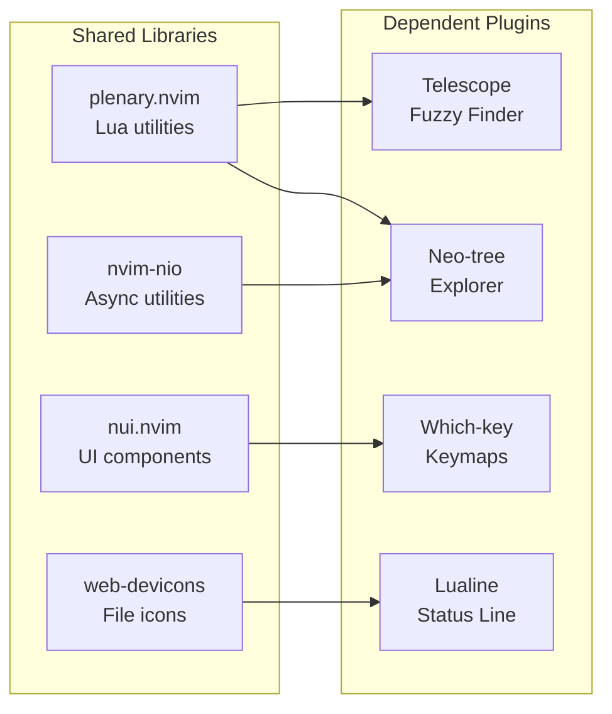
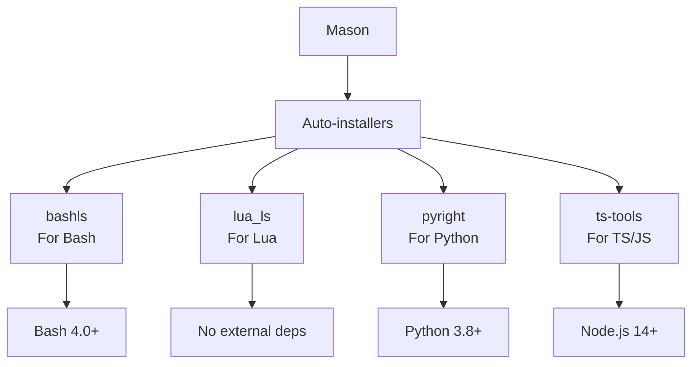
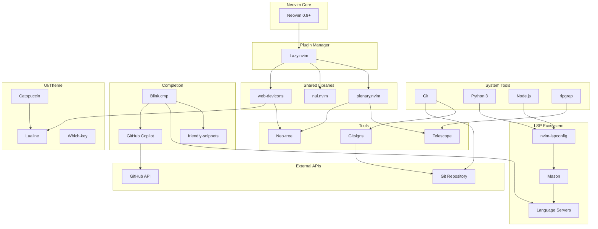

# Neovim Configuration Dependencies

## External Tool Dependencies

### Required System Tools

```mermaid
graph TB
    subgraph "Core Requirements"
        Git["Git<br/>Version control"]
        Node["Node.js<br/>Language servers"]
        Python["Python 3<br/>Python LSP & formatters"]
    end
    
    subgraph "Optional Enhancers"
        RipGrep["ripgrep (rg)<br/>Fast searching"]
        Make["make<br/>Build tool"]
        FZF["FZF<br/>Fuzzy matching"]
    end
    
    subgraph "Format-Specific"
        LaTeX["LaTeX<br/>Document compilation"]
        Pandoc["Pandoc<br/>Format conversion"]
    end
    
    Git -.-> "Gitsigns"
    Node -.-> "Language Servers"
    Python -.-> "Formatters"
    RipGrep -.-> "Telescope"
    Make -.-> "Build plugins"
```

### Tool Details

| Tool | Version | Purpose | Optional |
|------|---------|---------|----------|
| Git | 2.0+ | Version control, gitsigns | ❌ Required |
| ripgrep (rg) | 13.0+ | Fast text searching | ❌ Required |
| Python | 3.8+ | LSP (Pyright), formatters | ❌ Required |
| Node.js | 14.0+ | TypeScript, other LSPs | ❌ Required |
| make | 3.81+ | Build telescope-fzf-native | ✅ Optional |
| Bash | 4.0+ | Shell scripting, LSP | ✅ Optional |
| LaTeX | TeX Live+ | LaTeX compilation | ✅ Optional |
| Pandoc | 2.0+ | Document conversion | ✅ Optional |

---

## Plugin Manager Dependency

### Lazy.nvim
- **Purpose**: Asynchronous plugin manager
- **Version**: Latest
- **Auto-installed**: Yes (bootstrap in init.lua)
- **Lock file**: `lazy-lock.json` (pins 48 plugins)
- **Lazy loading**: Configurable per plugin

---

## Core Plugin Dependencies

### Universal Dependencies (used by multiple plugins)



---

## Plugin-Specific Dependencies

### AI Plugin Dependencies

```
copilot.vim
  ├── GitHub Copilot API
  └── CopilotChat.nvim
      ├── plenary.nvim
      └── vim-repeat (optional)

avante.nvim
  └── claude-3.5-sonnet (API)

supermaven-nvim
  └── SuperMaven API
```

### UI Plugin Dependencies

```
catppuccin
  └── (No external dependencies)

lualine.nvim
  ├── nvim-web-devicons
  └── Catppuccin (color scheme)

which-key.nvim
  ├── nui.nvim
  └── plenary.nvim

noice.nvim
  ├── nui.nvim
  ├── nvim-notify (optional)
  └── messages.nvim (optional)

colorizer.nvim
  └── (No external dependencies)
```

### LSP Plugin Dependencies

```
mason.nvim
  ├── nvim-web-devicons
  └── Installer tools (git, wget)

mason-lspconfig.nvim
  ├── mason.nvim
  └── nvim-lspconfig

nvim-lspconfig
  └── Language servers (external)

blink.cmp
  ├── friendly-snippets
  ├── LSP (optional)
  └── nvim-cmp (alternative)

nvim-treesitter
  ├── Build tools (gcc/clang)
  └── Language parsers

none-ls.nvim
  ├── Formatter/linter tools (external)
  └── null-ls-extras (optional)

typescript-tools.nvim
  └── Node.js TypeScript tools
```

### Tool Plugin Dependencies

```
telescope.nvim
  ├── plenary.nvim
  ├── telescope-fzf-native.nvim (compiled)
  └── ripgrep (rg command)

neo-tree.nvim
  ├── plenary.nvim
  ├── nvim-web-devicons
  ├── nvim-nio
  └── (Git support optional)

gitsigns.nvim
  ├── plenary.nvim
  └── Git

toggleterm.nvim
  └── (No external dependencies)

smart-splits.nvim
  └── (No external dependencies)

overseer.nvim
  ├── plenary.nvim
  └── Task definitions

obsidian.nvim
  ├── plenary.nvim
  └── Obsidian vault (filesystem)

vim-latex
  └── LaTeX distribution
```

### Feature Plugin Dependencies

```
nvim-comment
  └── (No external dependencies)

nvim-dap
  ├── nvim-dap-ui
  ├── nvim-dap-python
  ├── vscode-js-debug
  └── Debugger tools (python, node)

render-markdown.nvim
  └── Markdown processor

mini.nvim
  └── (No external dependencies)

vim-pencil
  └── (No external dependencies)

nvim-silicon
  └── silicon binary (external)

spellwarn
  └── Spell check dictionaries

snacks.nvim
  └── (No external dependencies)
```

---

## Language Server Dependencies

### Mason-Installed Servers



### Server Details

| Server | Language | Installation | Requirements |
|--------|----------|--------------|--------------|
| bashls | Bash | Auto (Mason) | Bash 4.0+ |
| lua_ls | Lua | Auto (Mason) | None |
| pyright | Python | Auto (Mason) | Python 3.8+ |
| ts-tools | TypeScript/JavaScript | Auto (Mason) | Node.js 14+ |

---

## Formatter and Linter Dependencies

### Formatter/Linter Tools

```
None-LS Configuration:
├── Formatters
│   ├── stylua (Lua) - Auto-installed via Mason
│   ├── black (Python) - Via pip or Mason
│   ├── biome (JS/TS/JSON) - Via npm or Mason
│   ├── beautysh (Bash) - Via pip or Mason
│   └── ruff (Python) - Via pip or Mason
│
└── Diagnostics
    ├── biome (JS/TS/JSON)
    ├── markdownlint (Markdown)
    └── pylint (Python - via Pyright)
```

### Tool Installation

| Tool | Type | Package Manager | Optional |
|------|------|-----------------|----------|
| stylua | Formatter | Luarocks/Mason | ❌ Core |
| black | Formatter | pip/Mason | ✅ Python only |
| biome | Formatter | npm/Mason | ✅ JS/TS only |
| beautysh | Formatter | pip/Mason | ✅ Bash only |
| ruff | Linter | pip/Mason | ✅ Python only |
| markdownlint | Linter | npm/Mason | ✅ Markdown only |

---

## Optional Feature Dependencies

### Document Compilation

| Feature | Tool | Purpose | Installation |
|---------|------|---------|--------------|
| LaTeX support | TeX Live | Compile .tex | Homebrew/apt |
| Pandoc conversion | Pandoc | Format conversion | Homebrew/apt |
| Code screenshots | Silicon | Image generation | Cargo/Homebrew |

---

## Git Integration Dependencies

### Gitsigns Requirements

```
gitsigns.nvim
├── Git (required)
├── Git >= 2.30 (for features)
└── Repository structure (required)

Git Status Display:
├── File changes (git diff)
├── Blame info (git blame)
├── Branch info (git branch)
└── Commit history (git log)
```

---

## Spell Checking Dependencies

### Spell Check Data

```
Spell files location: spell/
├── en.utf-8.spl (English dictionary)
├── en.utf-8.sug (English suggestions)
├── es.utf-8.spl (Spanish dictionary)
├── es.utf-8.sug (Spanish suggestions)
└── es.utf-8.spl (Spanish dictionary)

Supported Languages:
├── English (en)
├── Spanish (es)
└── Customizable
```

---

## External Service Dependencies

### GitHub Copilot

```
GitHub Copilot
├── GitHub account (required)
├── Copilot subscription (required)
├── GitHub CLI authentication (required)
└── Network connectivity (required)

Model: Claude 3.7 Sonnet
├── Maintained by Anthropic
└── Available via GitHub API
```

---

## Dependency Graph: Full System



---

## Dependency Compatibility Matrix

| Component | Neovim | Git | Python | Node | ripgrep |
|-----------|--------|-----|--------|------|---------|
| **Core Config** | 0.9+ | ✓ | ✓ | ✓ | ✓ |
| **LSP** | 0.9+ | - | 3.8+ | 14+ | - |
| **Telescope** | 0.9+ | - | - | - | 13+ |
| **Gitsigns** | 0.9+ | 2.30+ | - | - | - |
| **Formatters** | 0.9+ | - | 3.8+ | 14+ | - |
| **DAP** | 0.9+ | - | 3.8+ | 14+ | - |

---

## Missing Dependency Detection

### Check System Requirements

```bash
# Check Git
git --version

# Check Python
python3 --version

# Check Node.js
node --version

# Check ripgrep
rg --version

# Check LaTeX (optional)
latex --version

# Check Pandoc (optional)
pandoc --version
```

### Install Missing Tools

```bash
# macOS (Homebrew)
brew install git python3 node ripgrep
brew install --cask mactex  # LaTeX
brew install pandoc

# Ubuntu/Debian
sudo apt-get install git python3 nodejs npm ripgrep
sudo apt-get install texlive pandoc

# Fedora
sudo dnf install git python3 nodejs npm ripgrep
sudo dnf install texlive pandoc
```

---

## Lock File Management

### lazy-lock.json

```json
{
  "plugin-name": {
    "branch": "main",
    "commit": "abc123def456",
    "version": "1.2.3"
  },
  // ... 48 plugins total
}
```

- **Purpose**: Pin exact plugin versions
- **Generated**: By Lazy.nvim after updates
- **Update**: Run `:Lazy sync` in Neovim
- **Version Control**: Committed to git

---

## Dependency Installation Order

1. **System Tools** (brew/apt/dnf)
   - Git, Python 3, Node.js, ripgrep

2. **Neovim** (0.9+)
   - Via brew/apt/source

3. **Configuration** (git clone)
   - Dotfiles to ~/.config/nvim

4. **Plugin Manager** (auto-bootstrap)
   - Lazy.nvim installs on first launch

5. **Plugins** (auto-install)
   - Downloaded by Lazy.nvim

6. **Language Servers** (auto-install)
   - Installed by Mason on first LSP file

7. **External Tools** (optional)
   - LaTeX, Pandoc, Silicon as needed

---

## Troubleshooting Missing Dependencies

| Issue | Cause | Solution |
|-------|-------|----------|
| LSP not available | Language server not installed | Run `:Mason` and install required server |
| Telescope slow | ripgrep not installed | Install ripgrep: `brew install ripgrep` |
| Git signs not showing | Git not installed | Install git: `brew install git` |
| Python LSP missing | Python 3 not installed | Install: `brew install python3` |
| Formatting fails | Formatter not installed | Run `:Mason` and install formatter |
| Completions slow | Node not installed | Install: `brew install node` |

---

## Summary

The Neovim configuration has:

- **4 core system dependencies**: Git, Python 3, Node.js, ripgrep
- **1 primary plugin manager**: Lazy.nvim
- **3 shared libraries**: plenary.nvim, nui.nvim, web-devicons
- **48 managed plugins**: Pinned in lazy-lock.json
- **4 language servers**: bashls, lua_ls, pyright, ts-tools
- **Multiple formatters**: stylua, black, biome, ruff, beautysh
- **3 optional features**: LaTeX, Pandoc, Silicon
- **1 external API**: GitHub Copilot (optional)
- **Full git integration**: Via Gitsigns

All dependencies are either auto-installed or manually installable via system package managers.
