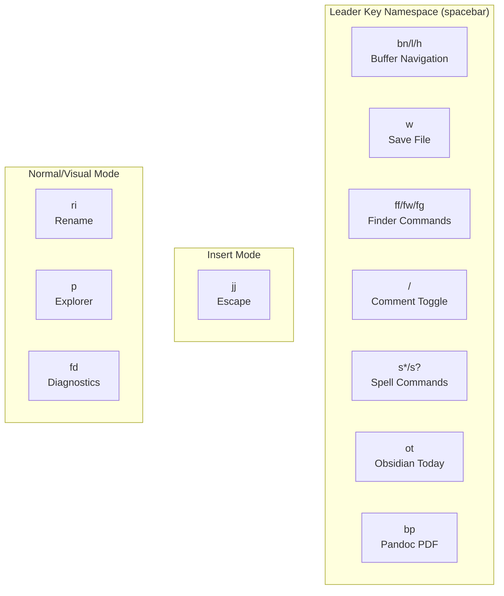
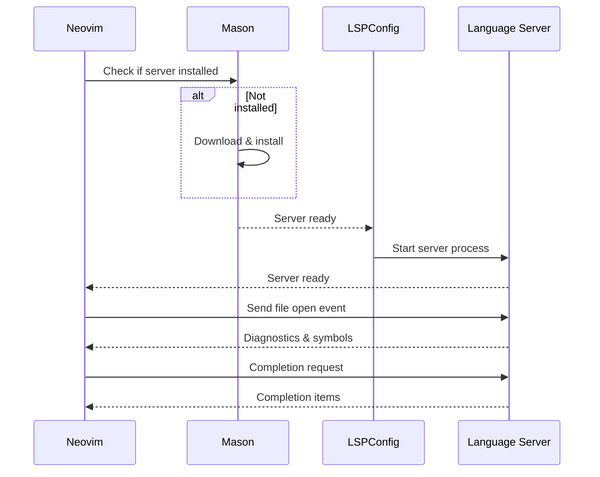
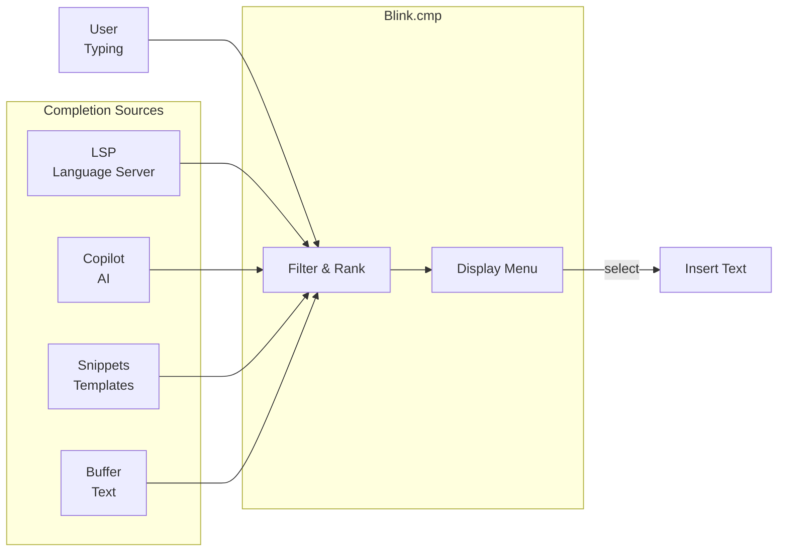

# Neovim Configuration Interfaces & APIs

## User Interface (Key Bindings)



## Key Binding Interface

### Buffer Navigation
| Binding | Mode | Action | File |
|---------|------|--------|------|
| `<leader>bn` | n | Next buffer | keymaps.lua |
| `<leader>l` | n | Next buffer (alias) | keymaps.lua |
| `<leader>h` | n | Previous buffer | keymaps.lua |

### File Operations
| Binding | Mode | Action | File |
|---------|------|--------|------|
| `<leader>w` | n | Save current file | keymaps.lua |

### Finder/Telescope
| Binding | Mode | Action | File |
|---------|------|--------|------|
| `<leader>ff` | n | Find files | keymaps.lua |
| `<leader>fw` | n | Live grep search | keymaps.lua |
| `<leader>fg` | n | Multi-type grep | keymaps.lua |
| `<leader>fd` | n | Find diagnostics | keymaps.lua |

### Editor Operations
| Binding | Mode | Action | File |
|---------|------|--------|------|
| `<leader>/` | n,v | Toggle comment | keymaps.lua |
| `<leader>p` | n | Toggle file explorer | keymaps.lua |
| `<leader>ri` | n,x | Rename (LSP) | keymaps.lua |

### Spell Checking
| Binding | Mode | Action | File |
|---------|------|--------|------|
| `<leader>sa` | n | Add to dictionary | keymaps.lua |
| `<leader>sn` | n | Next spelling error | keymaps.lua |
| `<leader>s?` | n | Suggest spelling | keymaps.lua |
| `<leader>s/` | n | Fuzzy spelling | keymaps.lua |

### Document Operations
| Binding | Mode | Action | File |
|---------|------|--------|------|
| `<leader>ot` | n | Obsidian: Today | keymaps.lua |
| `<leader>bp` | n | Pandoc: Build PDF | keymaps.lua |

### Insert Mode
| Binding | Mode | Action | File |
|---------|------|--------|------|
| `jj` | i | Escape key | keymaps.lua |

---

## Plugin Configuration Interface

### Plugin Spec Structure

Each plugin returns a specification table:

```lua
return {
  {
    "plugin-author/plugin-name",
    version = "*",
    event = "VimEnter",
    config = function()
      require("plugin-name").setup({
        -- configuration options
      })
    end,
    dependencies = {
      "dependency/plugin-name",
    }
  }
}
```

### Plugin Loading Events

| Event | When Triggered | Examples |
|-------|---|----------|
| `VimEnter` | Neovim startup complete | UI plugins, Telescope |
| `BufReadPre` | Before reading file | LSP, syntax |
| `BufRead` | After reading file | Obsidian, Markdown |
| `InsertEnter` | Enter insert mode | Completions |
| `FileType` | File type detection | Language-specific |
| `CmdwinEnter` | Command window open | Tools |
| `LspAttach` | LSP attaches | LSP commands |

---

## LSP (Language Server Protocol) Interface



### LSP Server Configuration

**Location**: `lua/plugins/lsp/lsp-config.lua`

**Installed Servers**:
```lua
local servers = {
  bashls = {},
  lua_ls = {
    settings = {
      Lua = {
        runtime = { version = "LuaJIT" },
        -- ...
      }
    }
  },
  pyright = {},
  ts-tools = {},
}
```

### LSP Commands Available

| Command | Function | Binding |
|---------|----------|---------|
| `vim.lsp.buf.rename()` | Rename symbol | `<leader>ri` |
| `vim.lsp.buf.code_action()` | Code actions | N/A (via CopilotChat) |
| `vim.lsp.buf.definition()` | Go to definition | N/A |
| `vim.lsp.buf.hover()` | Show hover info | N/A |
| `vim.lsp.buf.references()` | Find references | N/A |
| `vim.lsp.buf.format()` | Format code | N/A |

### Diagnostic Display

Diagnostics shown via:
- Inline error/warning messages
- Gutter signs (emoji-based)
- Quickfix list via `<leader>fd`

---

## Completion Interface



### Completion Engine: Blink.cmp

**Configuration File**: `lua/plugins/lsp/completion.lua`

**Completion Sources** (priority order):
1. LSP (language server)
2. Snippets (code templates)
3. Buffer (surrounding text)
4. Path (file paths)

**Note**: Copilot is **intentionally separate** — it runs as a parallel suggestion engine with `<C-Y>` / `<C-o>` keybindings rather than in the completion menu. See [AI Completion Interface](#ai-completion-interface) for details.

**Triggers**:
- Automatic on character input
- Manual with `<C-Space>`

**Navigation**:
- `<Tab>` / `<S-Tab>`: Select item
- `<CR>`: Confirm selection
- `<C-E>`: Cancel completion

---

## AI Completion Interface

### GitHub Copilot

**Configuration File**: `lua/plugins/ai/copilot.lua`

**Acceptance Keybindings**:
| Binding | Action |
|---------|--------|
| `<C-Y>` | Accept full suggestion |
| `<C-o>` | Accept next token only |

**Architecture Decision**: Copilot runs as a **parallel suggestion engine**, not integrated into Blink.cmp completion menu.

**Design Rationale**:
- ✅ **Faster interaction**: `<C-Y>` / `<C-o>` is quicker than opening completion menu
- ✅ **Non-intrusive**: Ghost text appears inline without menu overhead
- ✅ **Cleaner workflow**: Single key press to accept vs menu navigation
- ✅ **Minimal latency**: No menu rendering delay
- **Trade-off**: Copilot suggestions appear separately from LSP/snippets/buffer suggestions

**Why Not in Blink.cmp**: Completion menus add visual and performance overhead. Copilot's inline suggestions with quick accept keys provide superior UX for coding workflows.

**API Functions**:
```lua
:Copilot status          -- Check Copilot status
:Copilot panel open      -- Open suggestions panel
:CopilotChat             -- Open chat interface
```

**Chat Interface** (`CopilotChat.nvim`):
- Open with command or keybinding
- Ask questions about code
- Get suggestions and explanations

**Model**: Claude 3.7 Sonnet (latest)

**Integration Points**:
- Ghost text suggestions (inline, non-menu based)
- Acceptance via `<C-Y>` and `<C-o>` keybindings
- Chat interface for conversations
- Code-specific context from open buffers

---

## File Explorer Interface (Neo-tree)

**Configuration File**: `lua/plugins/tools/filemanager.lua`

**Toggle Command**: `<leader>p`

**Operations**:
| Action | Key | Purpose |
|--------|-----|---------|
| Open/Close | `<leader>p` | Toggle explorer |
| Navigate | `j/k` | Up/down |
| Enter | `<CR>` | Open file/folder |
| Create File | `a` | New file |
| Create Dir | `A` | New directory |
| Delete | `d` | Delete file |
| Rename | `r` | Rename file |
| Copy | `c` | Copy file |
| Move | `m` | Move file |

**Features**:
- Git status indicators
- File filtering
- Tree collapse/expand
- Hidden file toggle

---

## Finder Interface (Telescope)

**Configuration File**: `lua/plugins/tools/telescope.lua`

**Key Bindings**:
| Binding | Action |
|---------|--------|
| `<leader>ff` | Find files |
| `<leader>fw` | Live grep |
| `<leader>fg` | Multi-grep |
| `<leader>fd` | Diagnostics |

**Navigation** (in Telescope window):
| Key | Action |
|-----|--------|
| `<C-j/k>` | Move down/up |
| `<C-x>` | Open in split |
| `<C-v>` | Open in vsplit |
| `<C-t>` | Open in tab |
| `<CR>` | Select |
| `<ESC>` | Close |

**Grep Options**:
- Live grep updates as you type
- Multi-type grep for complex searches
- Diagnostics search across all files

---

## Git Integration Interface (Gitsigns)

**Configuration File**: `lua/plugins/tools/gitsigns.lua`

**Visual Indicators**:
- Gutter signs show changed/added/removed lines
- Colors indicate change type
- Blame information available

**Available Commands**:
```lua
:Gitsigns blame_line       -- Show blame for current line
:Gitsigns toggle_signs     -- Toggle gutter signs
:Gitsigns stage_hunk       -- Stage current hunk
:Gitsigns reset_hunk       -- Discard current hunk
```

---

## Spell Checking Interface

**Configuration File**: `lua/plugins/features/spell.lua`

**Available Spells**:
- English (en.utf-8)
- Spanish (es.utf-8)

**Key Bindings**:
| Binding | Action |
|---------|--------|
| `<leader>sa` | Add word to dictionary |
| `<leader>sn` | Next spelling error |
| `<leader>s?` | Show suggestions |
| `<leader>s/` | Fuzzy find suggestions |

**Dictionary Files**: `spell/` directory

---

## Debug Interface (DAP)

**Configuration File**: `lua/plugins/features/dap.lua`

**Available Debuggers**:
- Python (via nvim-dap-python)
- JavaScript (via vscode-js-debug)

**Commands**:
```lua
:DapToggleBreakpoint     -- Toggle breakpoint
:DapContinue             -- Continue execution
:DapStepOver             -- Step over line
:DapStepInto             -- Step into function
:DapRepl open            -- Open REPL
```

---

## Terminal Interface (Toggleterm)

**Configuration File**: `lua/plugins/tools/toggleterm.lua`

**Toggle Terminal**: Single command/binding  
**Multiple Terminals**: Each terminal is independent  
**Language Highlighting**: Terminal text highlighting by language

---

## Note-Taking Interface (Obsidian)

**Configuration File**: `lua/plugins/tools/obsidian.lua`

**Key Bindings**:
| Binding | Action |
|---------|--------|
| `<leader>ot` | Open today's note |

**Commands**:
```lua
:ObsidianOpen             -- Open note in Obsidian
:ObsidianNew              -- Create new note
:ObsidianQuickSwitch      -- Switch to note
```

**Vault Configuration**:
- Notes workspace location
- Default file format
- Completion support

---

## External Tool Integration

### Formatters Interface

**Configuration File**: `lua/plugins/lsp/none-ls.lua`

**Available Formatters**:
| Language | Formatter | Command |
|----------|-----------|---------|
| Lua | stylua | Auto-format |
| Python | black | Auto-format |
| JS/TS | biome | Auto-format |
| Bash | beautysh | Auto-format |
| Python | ruff | Auto-format |

**Format on Save**: Available via LSP  
**Manual Format**: Via editor command

### Diagnostics Interface

**Diagnostic Sources**:
- Biome (JS/TS/JSON)
- Markdownlint (Markdown)
- LSP servers (language-specific)

**Display**:
- Inline diagnostics
- Virtual text (error messages)
- Gutter signs (colors)
- Quickfix list

---

## Configuration Modification Interface

### How to Extend the Configuration

#### Add New Plugin

```lua
-- Create: lua/plugins/[category]/[newplugin].lua
return {
  {
    "author/plugin-name",
    event = "VimEnter",
    config = function()
      require("plugin-name").setup({
        -- options
      })
    end
  }
}
-- Auto-loaded by category init.lua
```

#### Add New Keybinding

```lua
-- Edit: lua/keymaps.lua
map("n", "<leader>xx", "<cmd>command<CR>", { desc = "Description" })
```

#### Add New Option

```lua
-- Edit: lua/options.lua
vim.opt.newOption = value
```

#### Customize Theme

```lua
-- Edit: lua/plugins/ui/catppuccin.lua
colors = {
  custom_color = "#RRGGBB",
}
```

---

## Environment Variables & Settings

### Neovim Settings
| Setting | Value | Location |
|---------|-------|----------|
| Leader Key | Spacebar | init.lua |
| Folding | Tree-Sitter | options.lua |
| Mouse | Enabled | options.lua |
| Clipboard | System sync | options.lua |
| Indentation | 2 spaces | options.lua |

### External Configuration
| Tool | Configuration | Location |
|------|---|----------|
| LSP | Mason | lsp-config.lua |
| Git | System git | gitsigns.lua |
| Spell | Dictionary files | spell/ |

---

## API Summary

This configuration provides interfaces for:

1. **User Interaction**: 20+ keybindings organized by function
2. **Language Services**: LSP with 4 configured servers
3. **AI Assistance**: GitHub Copilot with Claude model
4. **Code Completion**: Multi-source completion engine
5. **File Navigation**: Explorer and fuzzy finder
6. **Version Control**: Git integration with visual indicators
7. **Debugging**: DAP support for Python and JavaScript
8. **Documentation**: Spell checking and markdown rendering
9. **Terminal**: Integrated terminal with language support
10. **Notes**: Obsidian vault integration
11. **Writing**: Multiple writing mode options
12. **Extensibility**: Plugin and configuration modification interfaces

All interfaces follow Lua conventions and integrate seamlessly with Lazy.nvim plugin architecture.
