# Neovim Configuration Workflows

## User Workflows

### Workflow 1: Basic Editing Session

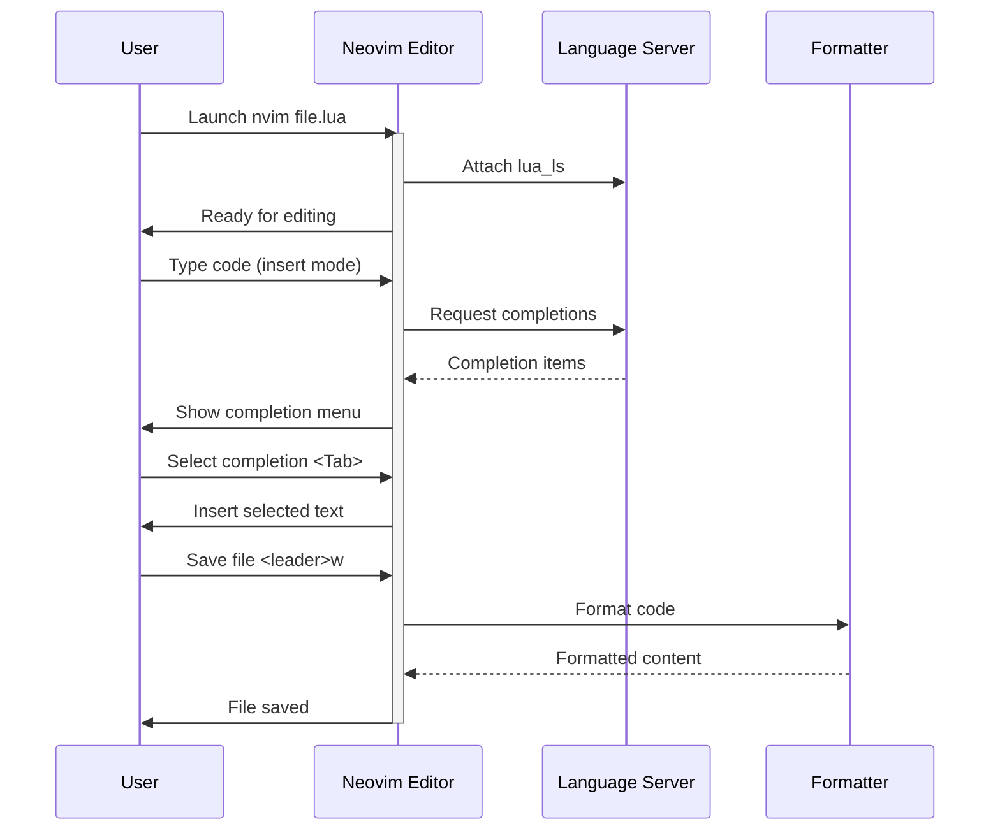
```mermaid
sequenceDiagram
    participant User
    participant Neovim as Neovim Editor
    participant LSP as Language Server
    participant Formatter as Formatter
    
    User->>Neovim: Launch nvim file.lua
    activate Neovim
    Neovim->>LSP: Attach lua_ls
    Neovim->>User: Ready for editing
    
    User->>Neovim: Type code (insert mode)
    Neovim->>LSP: Request completions
    LSP-->>Neovim: Completion items
    Neovim->>User: Show completion menu
    
    User->>Neovim: Select completion <Tab>
    Neovim->>User: Insert selected text
    
    User->>Neovim: Save file <leader>w
    Neovim->>Formatter: Format code
    Formatter-->>Neovim: Formatted content
    Neovim->>User: File saved
    deactivate Neovim
```

### Workflow 2: Code Search and Navigation

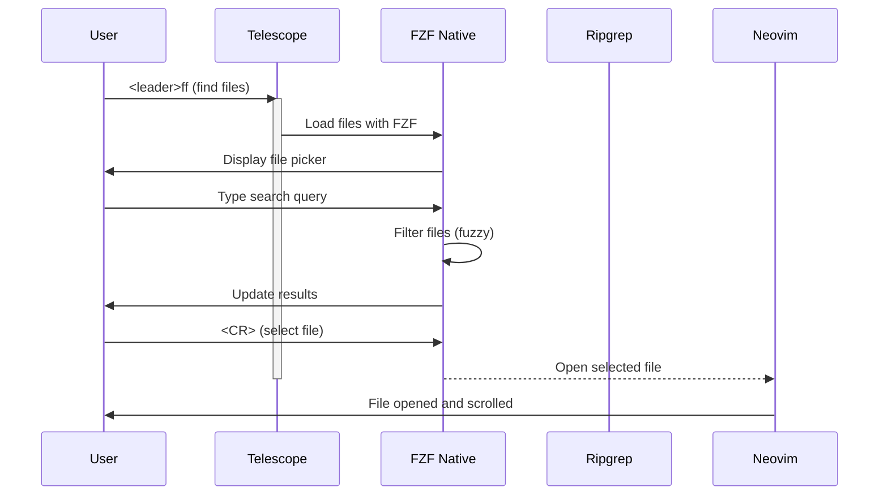
```mermaid
sequenceDiagram
    participant User
    participant Telescope as Telescope
    participant FZF as FZF Native
    participant Ripgrep as Ripgrep
    participant Neovim as Neovim
    
    User->>Telescope: <leader>ff (find files)
    activate Telescope
    Telescope->>FZF: Load files with FZF
    FZF->>User: Display file picker
    
    User->>FZF: Type search query
    FZF->>FZF: Filter files (fuzzy)
    FZF->>User: Update results
    
    User->>FZF: <CR> (select file)
    FZF-->>Neovim: Open selected file
    deactivate Telescope
    Neovim->>User: File opened and scrolled
```

### Workflow 3: Git-aware Development

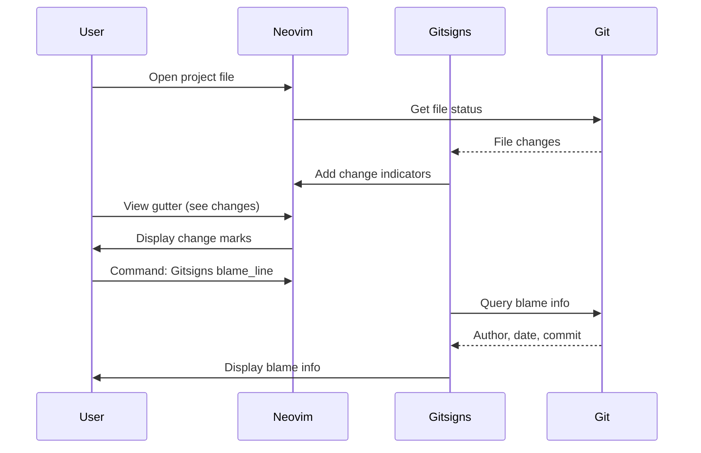
```mermaid
sequenceDiagram
    participant User
    participant Neovim as Neovim
    participant Gitsigns as Gitsigns
    participant Git as Git
    
    User->>Neovim: Open project file
    Neovim->>Git: Get file status
    Git-->>Gitsigns: File changes
    Gitsigns->>Neovim: Add change indicators
    
    User->>Neovim: View gutter (see changes)
    Neovim->>User: Display change marks
    
    User->>Neovim: Command: Gitsigns blame_line
    Gitsigns->>Git: Query blame info
    Git-->>Gitsigns: Author, date, commit
    Gitsigns->>User: Display blame info
```

### Workflow 4: AI-Assisted Coding

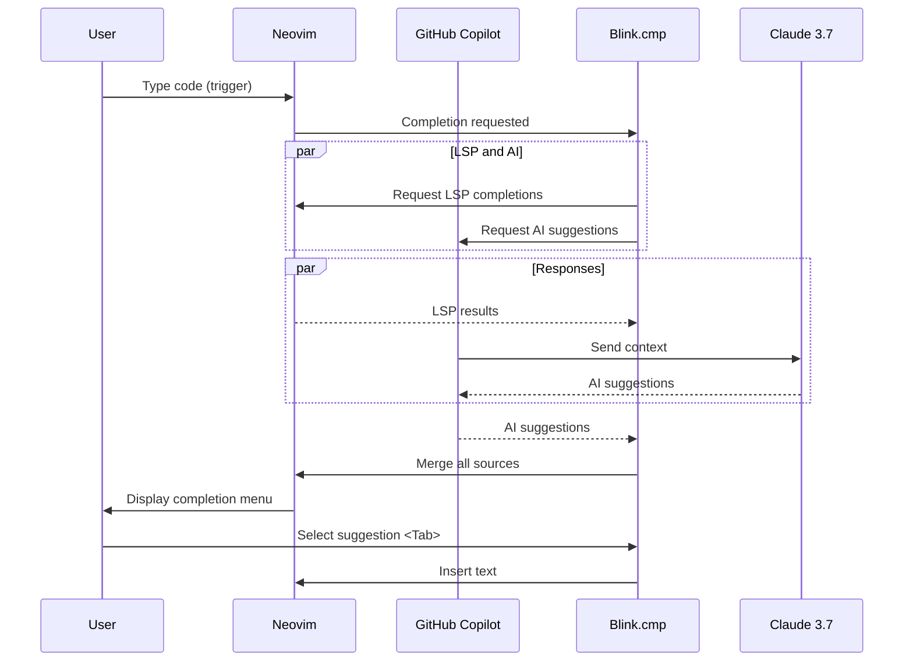
```mermaid
sequenceDiagram
    participant User
    participant Neovim as Neovim
    participant Copilot as GitHub Copilot
    participant Blink as Blink.cmp
    participant Claude as Claude 3.7
    
    User->>Neovim: Type code (trigger)
    Neovim->>Blink: Completion requested
    
    par LSP and AI
        Blink->>Neovim: Request LSP completions
        Blink->>Copilot: Request AI suggestions
    end
    
    par Responses
        Neovim-->>Blink: LSP results
        Copilot->>Claude: Send context
        Claude-->>Copilot: AI suggestions
    end
    
    Copilot-->>Blink: AI suggestions
    Blink->>Neovim: Merge all sources
    Neovim->>User: Display completion menu
    
    User->>Blink: Select suggestion <Tab>
    Blink->>Neovim: Insert text
```

### Workflow 5: Documentation and Writing

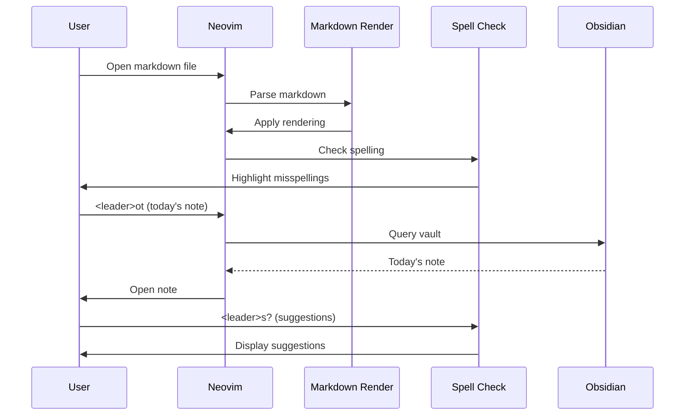
```mermaid
sequenceDiagram
    participant User
    participant Neovim as Neovim
    participant Markdown as Markdown Render
    participant Spell as Spell Check
    participant Obsidian as Obsidian
    
    User->>Neovim: Open markdown file
    Neovim->>Markdown: Parse markdown
    Markdown->>Neovim: Apply rendering
    
    Neovim->>Spell: Check spelling
    Spell->>User: Highlight misspellings
    
    User->>Neovim: <leader>ot (today's note)
    Neovim->>Obsidian: Query vault
    Obsidian-->>Neovim: Today's note
    Neovim->>User: Open note
    
    User->>Spell: <leader>s? (suggestions)
    Spell->>User: Display suggestions
```

### Workflow 6: File Management

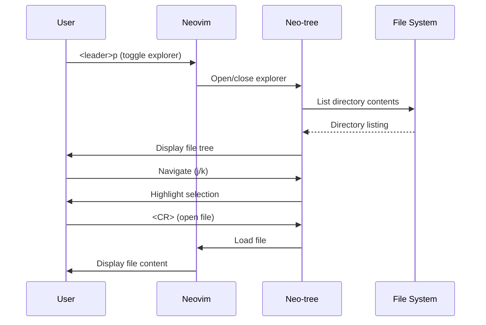
```mermaid
sequenceDiagram
    participant User
    participant Neovim as Neovim
    participant NeoTree as Neo-tree
    participant FileSystem as File System
    
    User->>Neovim: <leader>p (toggle explorer)
    Neovim->>NeoTree: Open/close explorer
    NeoTree->>FileSystem: List directory contents
    FileSystem-->>NeoTree: Directory listing
    
    NeoTree->>User: Display file tree
    
    User->>NeoTree: Navigate (j/k)
    NeoTree->>User: Highlight selection
    
    User->>NeoTree: <CR> (open file)
    NeoTree->>Neovim: Load file
    Neovim->>User: Display file content
```

---

## Development Workflows

### Workflow: Debug Python Code

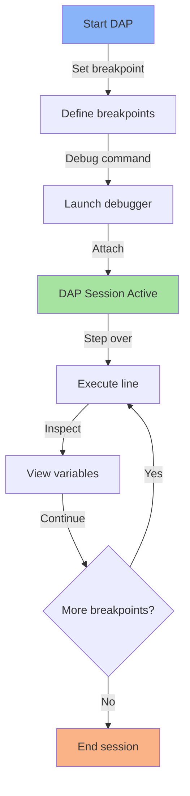
```mermaid
graph TD
    A["Start DAP"] -->|Set breakpoint| B["Define breakpoints"]
    B -->|Debug command| C["Launch debugger"]
    C -->|Attach| D["DAP Session Active"]
    D -->|Step over| E["Execute line"]
    E -->|Inspect| F["View variables"]
    F -->|Continue| G{More breakpoints?}
    G -->|Yes| E
    G -->|No| H["End session"]
    
    style A fill:#89b4fa
    style D fill:#a6e3a1
    style H fill:#fab387
```

### Workflow: Code Refactoring

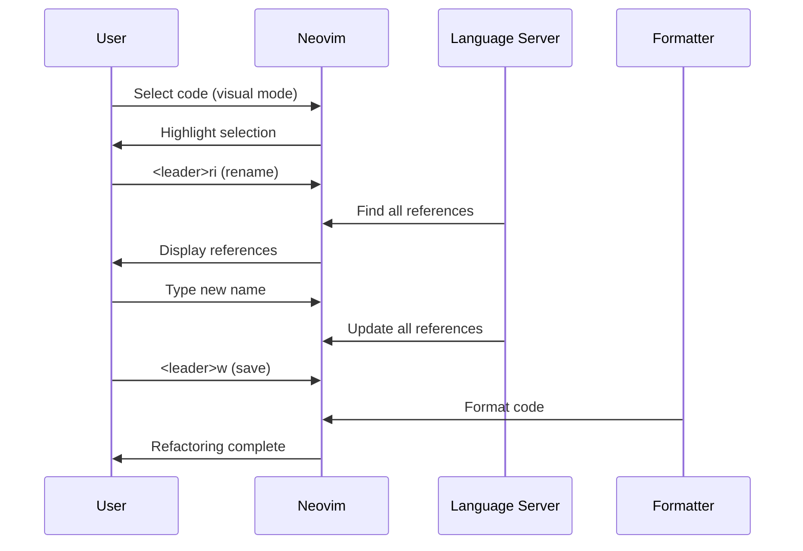
```mermaid
sequenceDiagram
    participant User
    participant Neovim as Neovim
    participant LSP as Language Server
    participant Formatter as Formatter
    
    User->>Neovim: Select code (visual mode)
    Neovim->>User: Highlight selection
    
    User->>Neovim: <leader>ri (rename)
    LSP->>Neovim: Find all references
    Neovim->>User: Display references
    
    User->>Neovim: Type new name
    LSP->>Neovim: Update all references
    
    User->>Neovim: <leader>w (save)
    Formatter->>Neovim: Format code
    Neovim->>User: Refactoring complete
```

### Workflow: Document Conversion

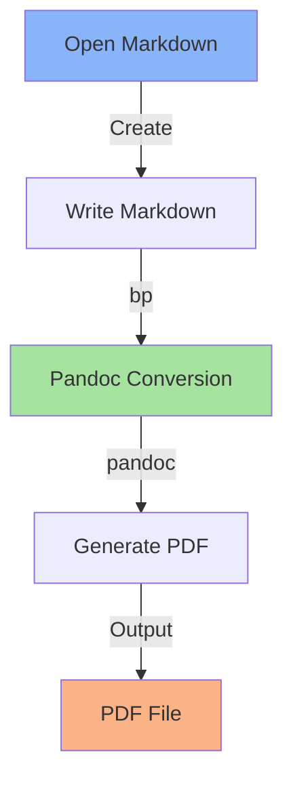
```mermaid
graph TB
    A["Open Markdown"] -->|Create| B["Write Markdown"]
    B -->|<leader>bp| C["Pandoc Conversion"]
    C -->|pandoc| D["Generate PDF"]
    D -->|Output| E["PDF File"]
    
    style A fill:#89b4fa
    style C fill:#a6e3a1
    style E fill:#fab387
```

---

## Plugin Loading Workflows

### Startup Workflow

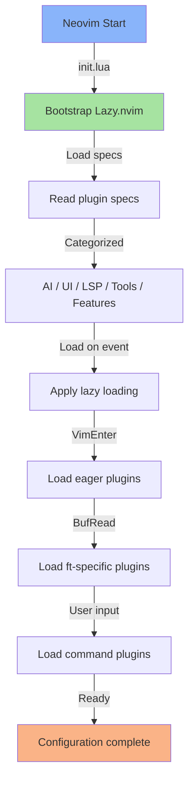
```mermaid
graph TD
    A["Neovim Start"] -->|init.lua| B["Bootstrap Lazy.nvim"]
    B -->|Load specs| C["Read plugin specs"]
    C -->|Categorized| D["AI / UI / LSP / Tools / Features"]
    D -->|Load on event| E["Apply lazy loading"]
    E -->|VimEnter| F["Load eager plugins"]
    F -->|BufRead| G["Load ft-specific plugins"]
    G -->|User input| H["Load command plugins"]
    H -->|Ready| I["Configuration complete"]
    
    style A fill:#89b4fa
    style B fill:#a6e3a1
    style I fill:#fab387
```

### Plugin Dependency Resolution

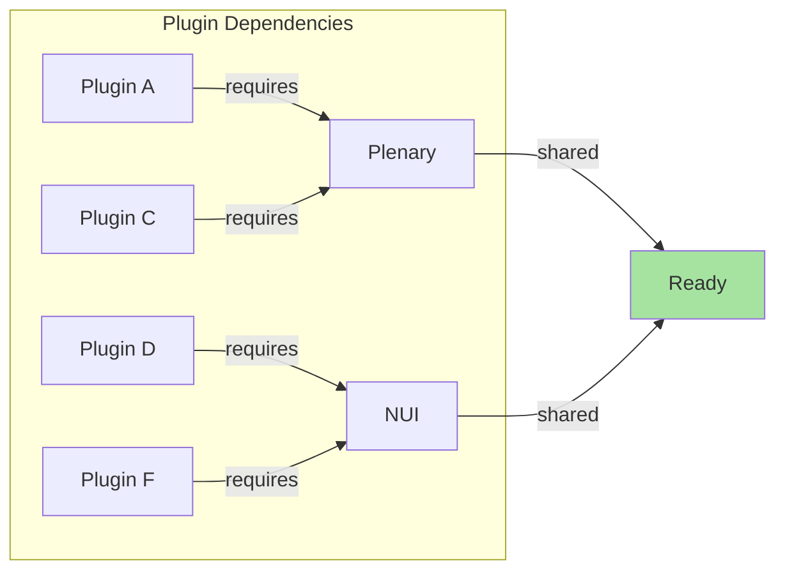
```mermaid
graph LR
    subgraph "Plugin Dependencies"
        A["Plugin A"] -->|requires| B["Plenary"]
        C["Plugin C"] -->|requires| B
        D["Plugin D"] -->|requires| E["NUI"]
        F["Plugin F"] -->|requires| E
    end
    
    B -->|shared| G["Ready"]
    E -->|shared| G
    
    style G fill:#a6e3a1
```

---

## LSP Workflows

### Language Server Initialization

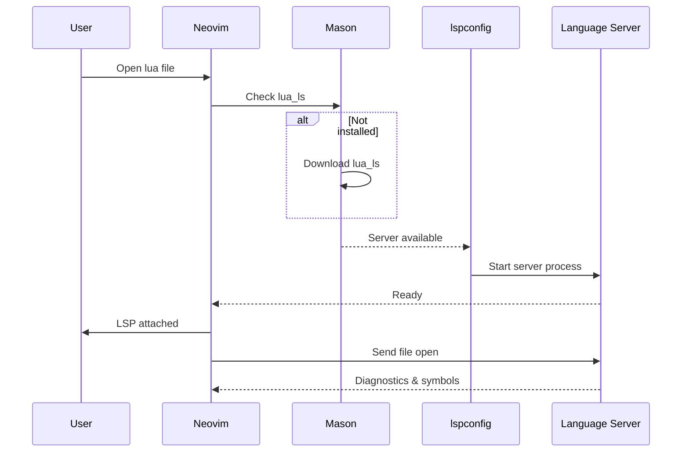
```mermaid
sequenceDiagram
    participant User
    participant Neovim as Neovim
    participant Mason as Mason
    participant LSP as lspconfig
    participant Server as Language Server
    
    User->>Neovim: Open lua file
    Neovim->>Mason: Check lua_ls
    alt Not installed
        Mason->>Mason: Download lua_ls
    end
    Mason-->>LSP: Server available
    
    LSP->>Server: Start server process
    Server-->>Neovim: Ready
    
    Neovim->>User: LSP attached
    Neovim->>Server: Send file open
    Server-->>Neovim: Diagnostics & symbols
```

### LSP Completion Workflow

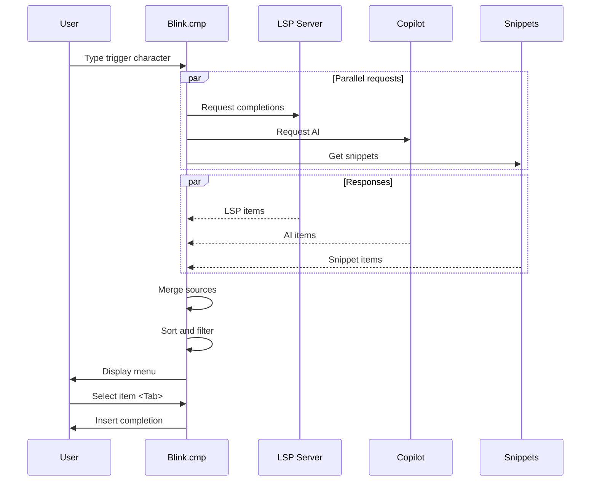
```mermaid
sequenceDiagram
    participant User
    participant Blink as Blink.cmp
    participant LSP as LSP Server
    participant Copilot as Copilot
    participant Snippets as Snippets
    
    User->>Blink: Type trigger character
    
    par Parallel requests
        Blink->>LSP: Request completions
        Blink->>Copilot: Request AI
        Blink->>Snippets: Get snippets
    end
    
    par Responses
        LSP-->>Blink: LSP items
        Copilot-->>Blink: AI items
        Snippets-->>Blink: Snippet items
    end
    
    Blink->>Blink: Merge sources
    Blink->>Blink: Sort and filter
    Blink->>User: Display menu
    
    User->>Blink: Select item <Tab>
    Blink->>User: Insert completion
```

---

## Formatting & Linting Workflows

### Code Format Workflow

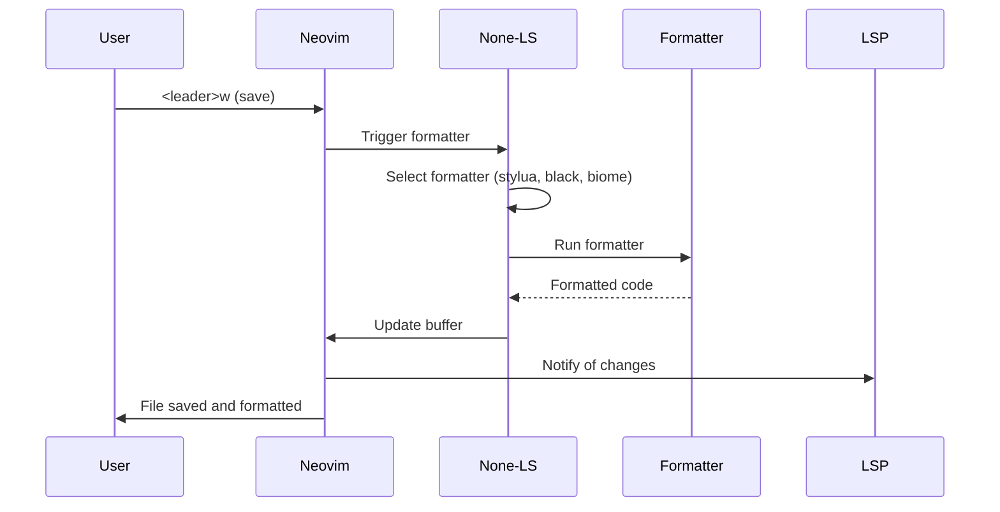
```mermaid
sequenceDiagram
    participant User
    participant Neovim as Neovim
    participant NoneLS as None-LS
    participant Formatter as Formatter
    participant LSP as LSP
    
    User->>Neovim: <leader>w (save)
    Neovim->>NoneLS: Trigger formatter
    NoneLS->>NoneLS: Select formatter (stylua, black, biome)
    NoneLS->>Formatter: Run formatter
    Formatter-->>NoneLS: Formatted code
    NoneLS->>Neovim: Update buffer
    Neovim->>LSP: Notify of changes
    Neovim->>User: File saved and formatted
```

### Diagnostics Workflow

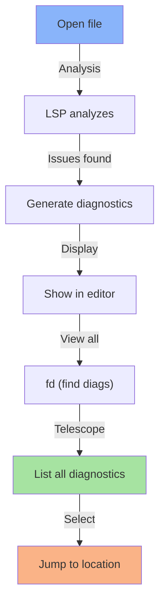
```mermaid
graph TD
    A["Open file"] -->|Analysis| B["LSP analyzes"]
    B -->|Issues found| C["Generate diagnostics"]
    C -->|Display| D["Show in editor"]
    D -->|View all| E["<leader>fd (find diags)"]
    E -->|Telescope| F["List all diagnostics"]
    F -->|Select| G["Jump to location"]
    
    style A fill:#89b4fa
    style F fill:#a6e3a1
    style G fill:#fab387
```

---

## Search and Navigation Workflows

### Multi-Search Workflow

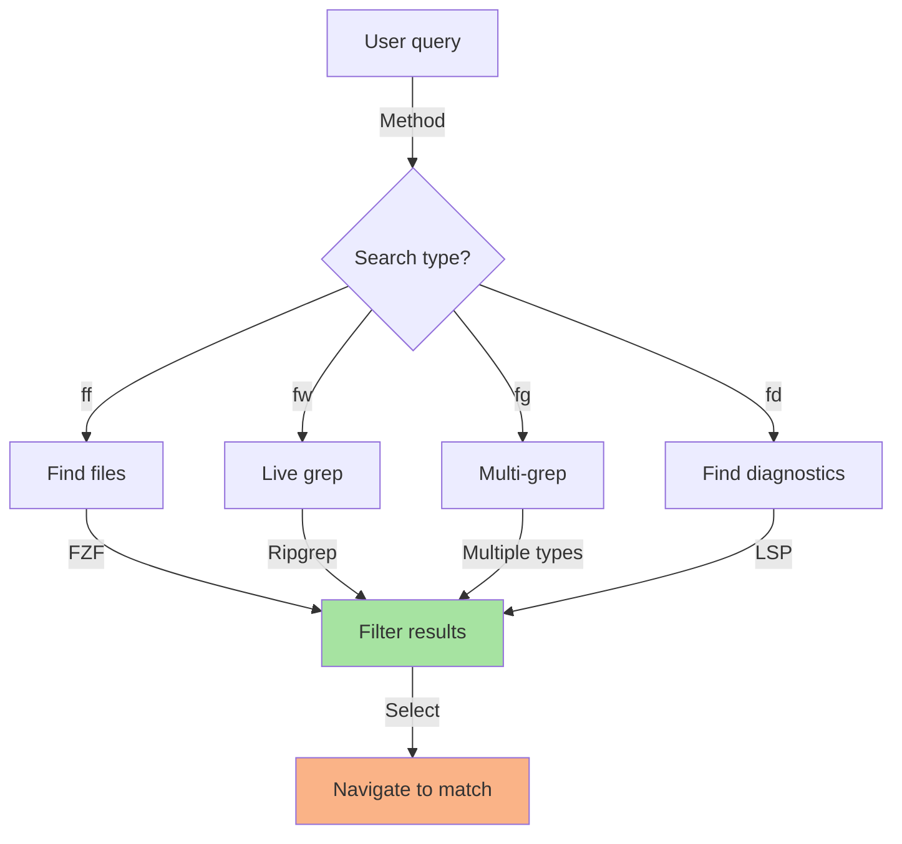
```mermaid
graph TB
    A["User query"] -->|Method| B{Search type?}
    B -->|<leader>ff| C["Find files"]
    B -->|<leader>fw| D["Live grep"]
    B -->|<leader>fg| E["Multi-grep"]
    B -->|<leader>fd| F["Find diagnostics"]
    
    C -->|FZF| G["Filter results"]
    D -->|Ripgrep| G
    E -->|Multiple types| G
    F -->|LSP| G
    
    G -->|Select| H["Navigate to match"]
    
    style G fill:#a6e3a1
    style H fill:#fab387
```

---

## Writing Mode Workflows

### Markdown Writing Workflow

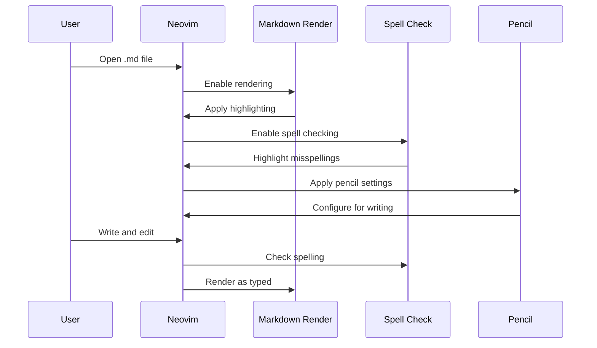
```mermaid
sequenceDiagram
    participant User
    participant Neovim as Neovim
    participant Markdown as Markdown Render
    participant Spell as Spell Check
    participant Pencil as Pencil
    
    User->>Neovim: Open .md file
    Neovim->>Markdown: Enable rendering
    Markdown->>Neovim: Apply highlighting
    
    Neovim->>Spell: Enable spell checking
    Spell->>Neovim: Highlight misspellings
    
    Neovim->>Pencil: Apply pencil settings
    Pencil->>Neovim: Configure for writing
    
    User->>Neovim: Write and edit
    Neovim->>Spell: Check spelling
    Neovim->>Markdown: Render as typed
```

### Note-Taking Workflow

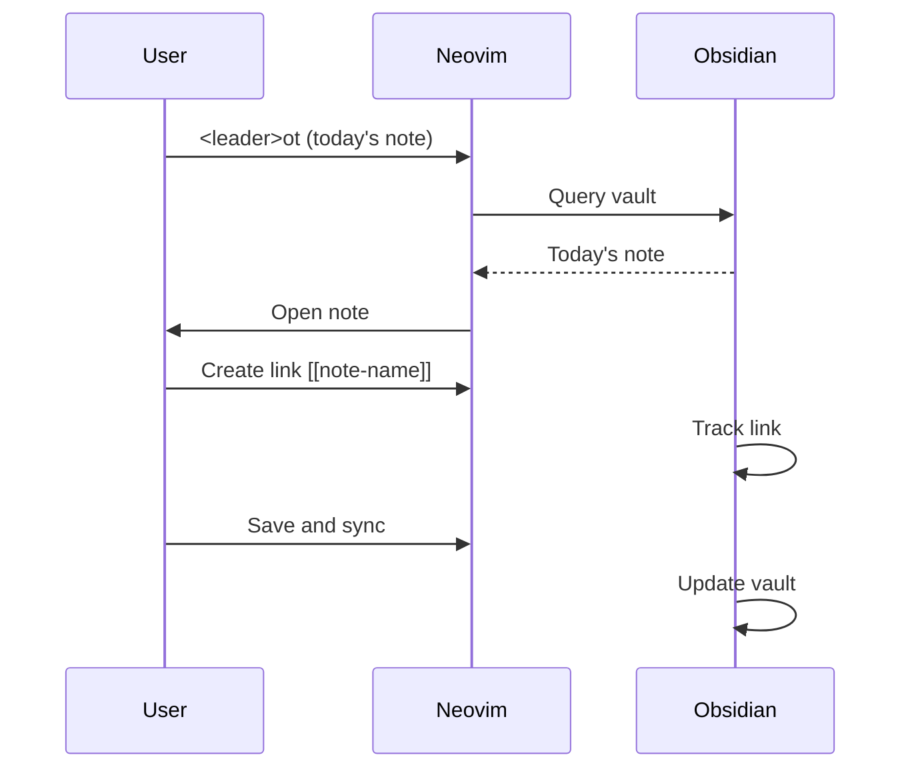
```mermaid
sequenceDiagram
    participant User
    participant Neovim as Neovim
    participant Obsidian as Obsidian
    
    User->>Neovim: <leader>ot (today's note)
    Neovim->>Obsidian: Query vault
    Obsidian-->>Neovim: Today's note
    Neovim->>User: Open note
    
    User->>Neovim: Create link [[note-name]]
    Obsidian->>Obsidian: Track link
    
    User->>Neovim: Save and sync
    Obsidian->>Obsidian: Update vault
```

---

## Error Handling Workflows

### LSP Error Handling

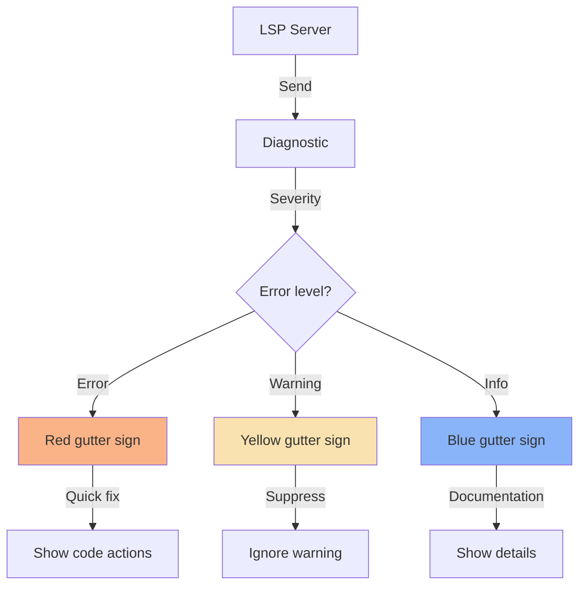
```mermaid
graph TD
    A["LSP Server"] -->|Send| B["Diagnostic"]
    B -->|Severity| C{Error level?}
    C -->|Error| D["Red gutter sign"]
    C -->|Warning| E["Yellow gutter sign"]
    C -->|Info| F["Blue gutter sign"]
    
    D -->|Quick fix| G["Show code actions"]
    E -->|Suppress| H["Ignore warning"]
    F -->|Documentation| I["Show details"]
    
    style D fill:#fab387
    style E fill:#f9e2af
    style F fill:#89b4fa
```

### Spell Check Error Workflow

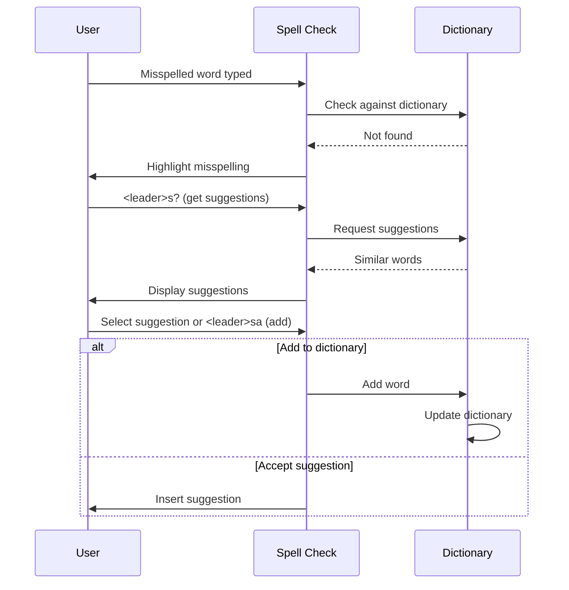
```mermaid
sequenceDiagram
    participant User
    participant Spell as Spell Check
    participant Dictionary as Dictionary
    
    User->>Spell: Misspelled word typed
    Spell->>Dictionary: Check against dictionary
    Dictionary-->>Spell: Not found
    Spell->>User: Highlight misspelling
    
    User->>Spell: <leader>s? (get suggestions)
    Spell->>Dictionary: Request suggestions
    Dictionary-->>Spell: Similar words
    Spell->>User: Display suggestions
    
    User->>Spell: Select suggestion or <leader>sa (add)
    alt Add to dictionary
        Spell->>Dictionary: Add word
        Dictionary->>Dictionary: Update dictionary
    else Accept suggestion
        Spell->>User: Insert suggestion
    end
```

---

## Extension Workflows

### Adding New Plugin Workflow

```mermaid
graph TD
    A["Decision: Add plugin"] -->|Create file| B["lua/plugins/category/plugin.lua"]
    B -->|Define spec| C["Return plugin table"]
    C -->|Auto-load| D["Category init.lua"]
    D -->|Lazy loading| E["Plugin ready"]
    E -->|On event| F["Plugin loads"]
    F -->|Setup| G["Configuration complete"]
    
    style E fill:#a6e3a1
    style G fill:#fab387
```

### Adding New Keymap Workflow

```mermaid
graph TD
    A["Need new keybinding"] -->|Edit| B["lua/keymaps.lua"]
    B -->|Follow pattern| C["map(mode, lhs, rhs)"]
    C -->|Apply convention| D["Use <leader> prefix"]
    D -->|Document| E["Add description"]
    E -->|Save| F["Reload config"]
    F -->|Ready| G["New keybinding active"]
    
    style F fill:#89b4fa
    style G fill:#a6e3a1
```

---

## Summary of Workflows

The configuration supports workflows for:

1. **Basic Editing**: Type, complete, save with formatting
2. **Navigation**: Find files, search text, navigate code
3. **Version Control**: Git integration, blame, change tracking
4. **AI Assistance**: Code completion, chat, suggestions
5. **Language Support**: LSP, formatting, diagnostics
6. **Debugging**: Set breakpoints, inspect, step through
7. **Writing**: Markdown rendering, spell check, note-taking
8. **File Management**: Explorer, create, delete, organize
9. **Refactoring**: Rename symbols, update references
10. **Documentation**: Convert formats, generate PDFs
11. **Extension**: Add plugins, keymaps, options
12. **Error Handling**: Diagnostics, spell check, code actions

All workflows are integrated seamlessly through lazy loading and event-driven plugin initialization.
