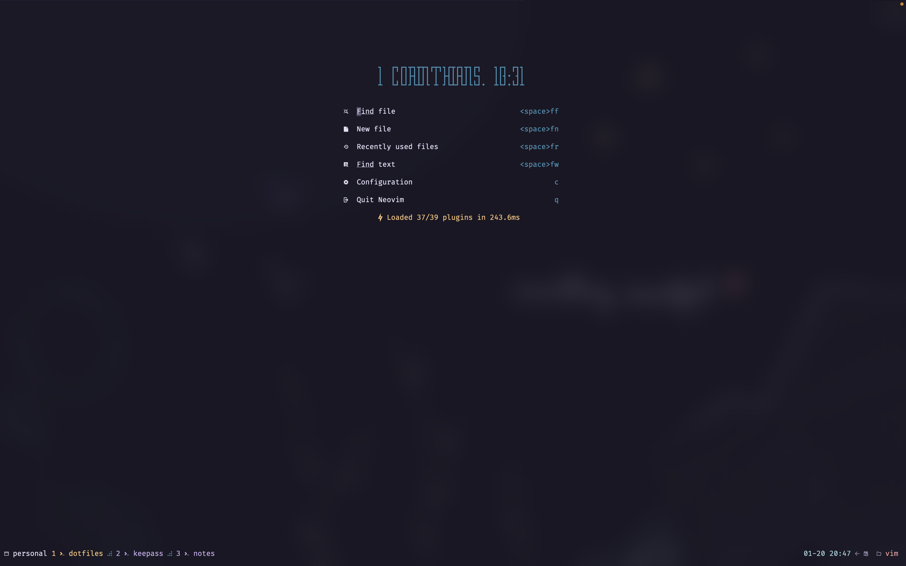
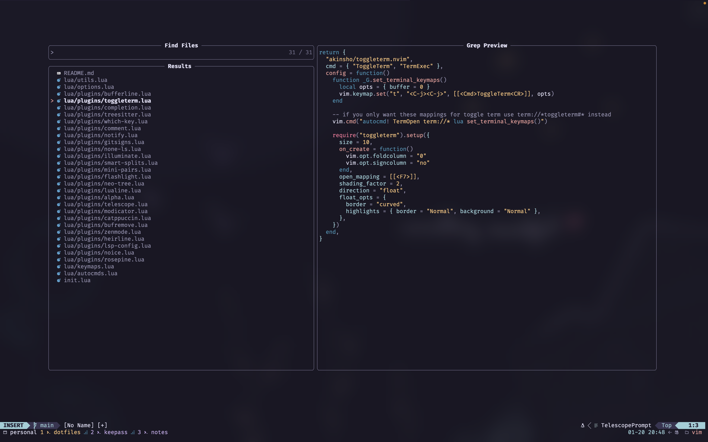
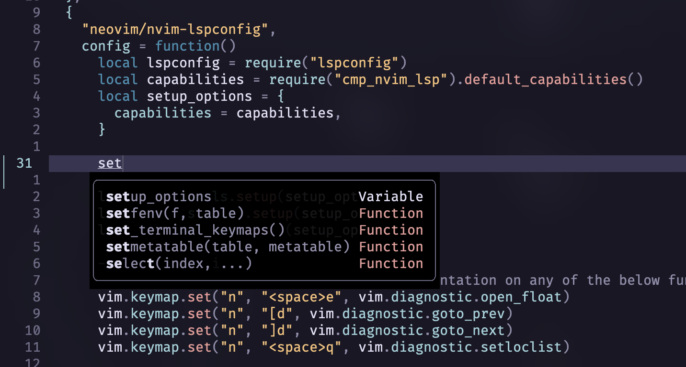
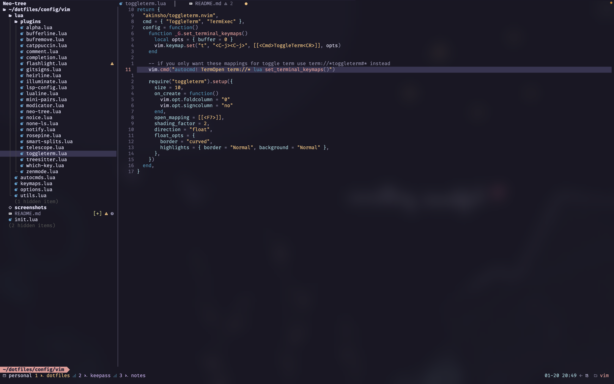
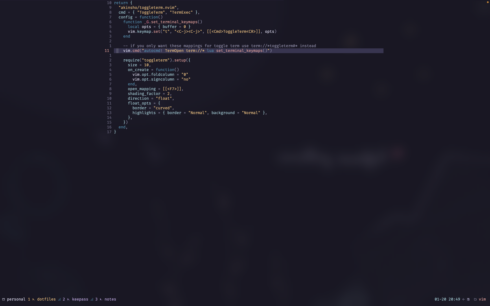

# NeoVim configuration

This is my personal configuration for NeoVim using Lazy vim.

## Screenshots











## Terminal

The terminal is Alacritty. Configuration for it:

```toml
import = ["~/.config/alacritty/rose-pine.toml"]

[cursor.style]
blinking = "Always"

[font]
size = 14

[font.normal]
family = "FiraCode Nerd Font Mono"
style = "Regular"

[window]
blur = true
decorations = "None"
opacity = 0.65
```

Theme is [`rose-pine`][1].

Background can be found [here][2].

## Autocompletions

Autocompletions work out of the box with the following languages (I've not tested with others):

- Python
- TypeScript
- Lua

[1]: https://github.com/rose-pine/alacritty
[2]: https://github.com/rose-pine/wallpapers/blob/main/something-beautiful-in-nature.jpg
